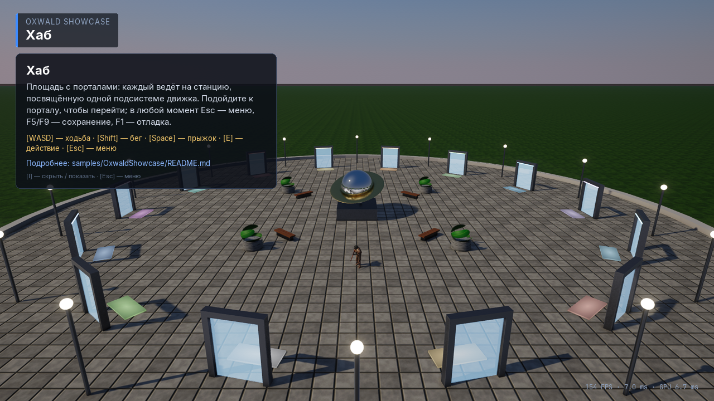
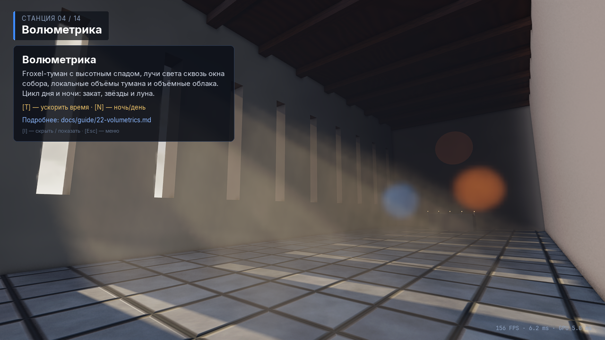
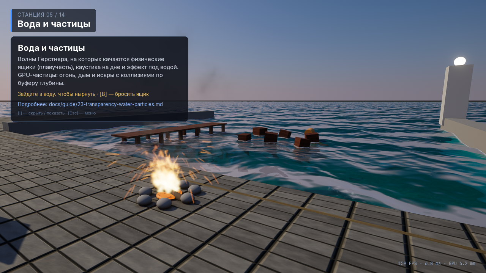
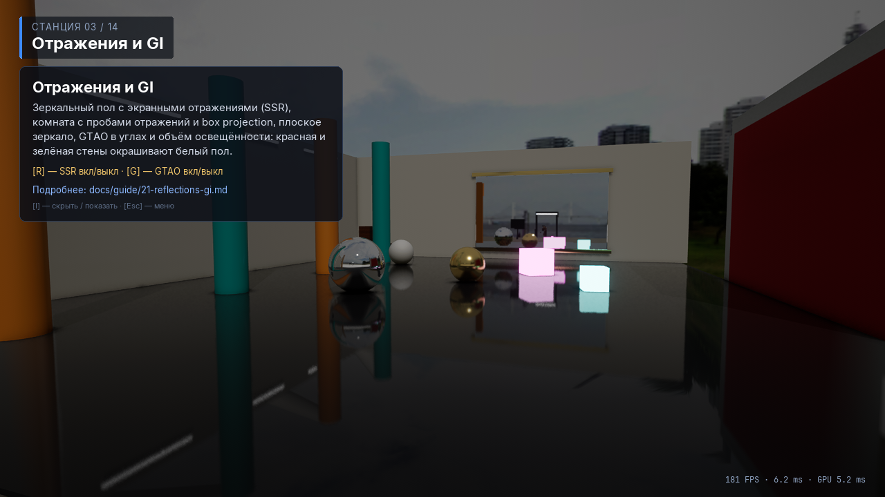
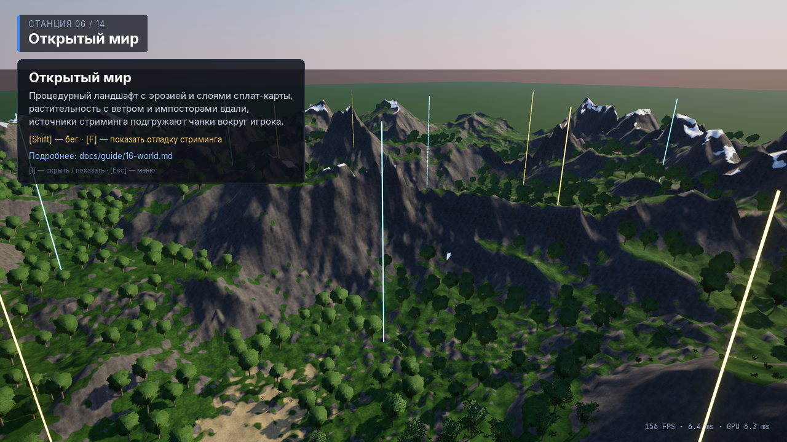
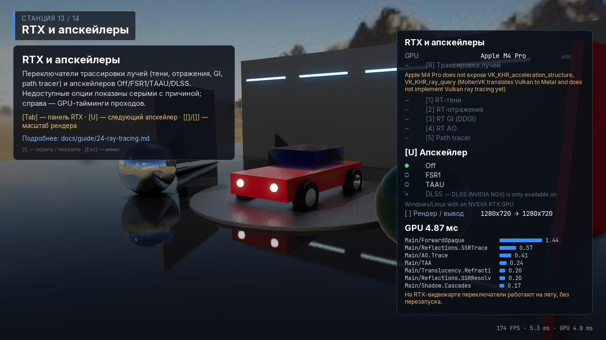
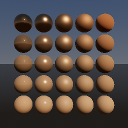
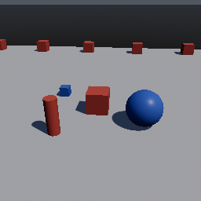
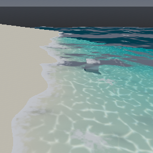
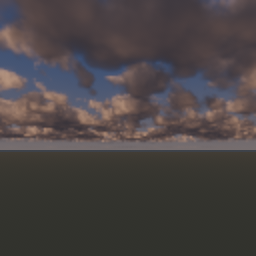

# OxwaldEngine

OxwaldEngine — игровой движок на C++20 с рендерером на Vulkan, ECS на EnTT, редактором на Qt 6 и скриптами на Lua.
Движок разбит на независимые модули (статические библиотеки `Oxwald::<module>`): `core`, `scene`, `rhi`, `assets`,
`render`, `physics`, `animation`, `spline`, `audio`, `ai`, `net`, `script`, `async`, `ui`, `world`, `gameplay`,
`runtime`. Поверх них собираются автономный рантайм **OxwaldPlayer** и редактор **OxwaldEditor**. Все сторонние
зависимости ставятся через vcpkg.


Демо-проект [OxwaldShowcase](samples/OxwaldShowcase/README.md) — хаб и 14 станций, по одной на подсистему движка:

| Хаб | Волюметрика | Вода и частицы |
| --- | --- | --- |
|  |  |  |
| **Отражения** | **Мир** | **RTX и апскейлеры** |
|  |  |  |

Эталонные изображения рендерера из тестов (`engine/render/tests/data/golden/`):

| PBR-материалы | Каскадные тени | Вода | Объёмные облака |
| --- | --- | --- | --- |
|  |  |  |  |

## Возможности

**Ядро и сцена**
- `core`: логирование, assert, `Result<T>`, математика (glm, Y-up, reversed-Z), UUID, сервисы (DI), события, job system
  (enkiTS), рефлексия типов с атрибутами, VFS, слежение за файлами, debug draw, профилирование через Tracy.
- Сериализация через рефлексию: бинарный формат OXB1 (версионирование полей, CRC) и JSON без потерь в обе стороны,
  утилита `oxdump`.
- CVar'ы и группы масштабируемости Low/Medium/High/Ultra в духе UE, автоопределение качества по GPU-бенчмарку.
- `scene`: ECS на EnTT (`World`/`Entity`), иерархия и трансформы, системы по фазам, сохранение сцен, префабы с overrides.
- Сохранения (в `runtime`): слоты, метаданные, поля с атрибутом `SaveGame`, секции `ISaveable`, миграции версий,
  атомарная запись, автосейв, асинхронное сохранение и загрузка.

**Рендеринг** (`rhi` + `render`)
- RHI на Vulkan: bindless, render graph с автоматическими барьерами и алиасингом, компиляция GLSL через shaderc
  с hot reload, BLAS/TLAS.
- Clustered forward+ PBR, IBL, тени: CSM, spot-тени в атласе, точечные тени, PCF/PCSS.
- Отражения: пробы с box projection, SSR, плоские зеркала; GTAO; irradiance volumes.
- Froxel-туман, объёмный свет и объёмные облака.
- Прозрачность: OIT, преломление, вода, GPU-частицы.
- Ray tracing: RT-тени, отражения, AO, DDGI, преломление; ReSTIR DI, path tracer, денойзер в стиле SVGF.
- Сглаживание и апскейлеры: TAA, TAAU, FXAA, FSR 1, DLSS (NGX).
- Постобработка: автоэкспозиция, bloom, DoF, motion blur, цветокоррекция и LUT, тонмаппинг ACES/AgX/Neutral.
- GPU-driven: отсечение на GPU (frustum + HiZ occlusion), LOD, меш-шейдеры и meshlets, async compute, стриминг мипов.
- Мир: ландшафт, растительность, небо; скиннинг в compute-шейдере.

**Игровые подсистемы**
- `physics`: Jolt — тела, формы, слои коллизий, запросы, соединения, контроллер персонажа.
- `animation`: скелеты, клипы, blend spaces, state machine, root motion, IK, скиннинг (CPU и GPU).
- `spline`: Безье, Catmull-Rom, B-сплайны/NURBS, параметризация по длине дуги, движение по пути, экструзия мешей.
- `audio`: miniaudio — 3D-звук, шины и микшер, эффекты, окклюзия.
- `ai`: Recast/Detour (навмеш, толпа, динамические препятствия), behavior trees, utility AI, восприятие.
- `net`: ENet, репликация с дельта-сжатием, интерполяция, предсказание на клиенте, выделенный сервер.
- `script`: Lua 5.4 + sol2, песочница, скрипты сущностей, hot reload.
- `async`: корутины C++20 (`Task`/`Future`, ожидание кадров и времени, переходы между потоками, `whenAll`/`whenAny`,
  отмена), `await` из Lua.
- `ui`: отладочный оверлей на Dear ImGui (статистика, консоль, cvar'ы, инспектор, render graph, корутины) и игровой
  UI на RmlUi (модели данных, hot reload, Lua).
- `world`: ландшафт с эрозией и CDLOD, растительность, солнце и луна, смена дня и ночи, ветер и погода, вода
  Герстнера с плавучестью, стриминг чанков.
- `gameplay`: ECS-компоненты и системы, связывающие все модули с миром.

**Приложения**
- `runtime` + OxwaldPlayer: `Engine`, игровой цикл с отдельным потоком рендера, ввод в стиле Enhanced Input, проекты
  `.oxproj`, пользовательские настройки, консоль, headless-режим и выделенный сервер.
- OxwaldEditor (Qt 6): вьюпорт на Vulkan, outliner, инспектор на основе рефлексии, браузер контента с миниатюрами,
  undo/redo, play-in-editor, инструменты сплайнов и ландшафта, настройки проекта и масштабируемости, интерфейс RU/EN.
- Инструменты: `oximport` (импорт ассетов), `oxpack` (упаковка проекта в `.oxpak`), `oxdump` (бинарные файлы ↔ JSON).

## Требования

- CMake ≥ 3.25, Ninja.
- [vcpkg](https://github.com/microsoft/vcpkg), переменная окружения `VCPKG_ROOT` указывает на его checkout.
- Компилятор с поддержкой C++20. На macOS используется AppleClang (`/usr/bin/clang++`), тот же, что собирает порты
  vcpkg; также нужны Xcode Command Line Tools и `brew install autoconf autoconf-archive automake libtool pkg-config`
  (инструменты сборки для некоторых портов).
- GPU с Vulkan 1.2+ и набором возможностей 1.3 (dynamic rendering, synchronization2, descriptor indexing,
  buffer device address, timeline semaphores). На macOS MoltenVK собирается из overlay-порта vcpkg.
- Для редактора — Qt 6 из vcpkg. Первая сборка Qt занимает много времени; без редактора можно обойтись
  (`--no-editor`).

## Быстрый старт

```sh
tools/bootstrap.sh                 # все зависимости через vcpkg в ./vcpkg_installed (включая Qt для редактора)
tools/bootstrap.sh --no-editor     # без Qt: движок, плеер и тесты

cmake --preset dev                 # конфигурация в build/dev (RelWithDebInfo); есть также debug и release
cmake --build --preset dev         # сборка всего
ctest --preset dev                 # все тесты
ctest --preset cpu                 # только тесты, которым не нужен GPU
```

Запуск плеера:

```sh
build/dev/bin/OxwaldPlayer --project path/to/MyGame          # окно, проект (папка или файл .oxproj)
build/dev/bin/OxwaldPlayer --headless --frames 600           # без окна, 600 кадров и выход
build/dev/bin/OxwaldPlayer --server --fps 60                 # выделенный сервер
build/dev/bin/OxwaldPlayer --project MyGame --quality low --cvar r.VSync=false
build/dev/bin/OxwaldPlayer --help                            # все опции
```

Другие опции: `--pak`, `--patch-pak` (патч-паки поверх `--pak`, см. `oxpack --patch`), `--scene`, `--width`/`--height`, `--fullscreen`/`--borderless`/`--windowed`, `--monitor`,
`--user-dir`, `--fixed-rate`, `--single-thread`; аргументы после `--` передаются коду игры.

Запуск редактора (на macOS это бандл):

```sh
build/dev/bin/OxwaldEditor.app/Contents/MacOS/OxwaldEditor                        # окно выбора проекта
build/dev/bin/OxwaldEditor.app/Contents/MacOS/OxwaldEditor --project MyGame.oxproj
```

Полезные опции CMake:
- `-DOX_MODULES="core;scene;physics"` — сконфигурировать только перечисленные модули и каталоги верхнего уровня
  (`editor`, `apps`, `tools`, `samples`); удобно для частичной сборки.
- `-DOX_WARNINGS_AS_ERRORS=ON|OFF` — предупреждения как ошибки (включено в пресетах `dev` и `debug`; код в
  `samples/` получает предупреждения, но не ошибки).
- `-DOX_BUILD_TESTS=OFF`, `-DOX_ENABLE_TRACY=OFF`, `-DOX_ENABLE_DLSS=OFF`. Редактор собирается, если найден Qt 6;
  чтобы его пропустить, не включайте `editor` в `OX_MODULES` (или ставьте зависимости с `--no-editor`).

## Структура репозитория

```
engine/<module>/        модули движка: include/oxwald/<module>/ (публичные заголовки), src/, tests/
engine/shaders/         GLSL-шейдеры (корень для #include)
editor/                 редактор OxwaldEditor (Qt 6)
apps/player/            OxwaldPlayer — автономный рантайм игры
tools/                  bootstrap.sh, oxdump, oximport, oxpack, rhi_window_smoke
samples/                OxwaldShowcase (демо-проект), guide_examples (компилируемые примеры из руководства)
docs/guide/             руководство пользователя (на русском)
docs/dev/               документация для разработчиков движка
vcpkg-overlays/         overlay-порты (MoltenVK, NVIDIA DLSS, Vulkan) и триплеты vcpkg
```

## Документация

- [Руководство пользователя](docs/guide/README.md) — главы по каждой подсистеме с проверенными примерами кода.
- [Архитектура и соглашения для контрибьюторов](docs/dev/ARCHITECTURE.md).
- [Заметки по модулям](docs/dev/modules/) — API, ограничения, детали реализации.
- [История изменений](CHANGELOG.md).

## Платформы

Движок разрабатывается и тестируется на **macOS arm64** (Apple GPU через MoltenVK). На этой платформе нет
аппаратного ray tracing, DLSS и меш-шейдеров: соответствующие эффекты отключены, переключатели в UI неактивны
и показывают причину, а GPU-тесты таких функций пропускаются (`GTEST_SKIP`), а не падают.

Windows и Linux должны работать: код и CMake для них есть, DLSS (NGX) доступен только на Windows/Linux с NVIDIA RTX.
Но в этом репозитории эти платформы пока не проверялись.

## Лицензия

Лицензия проекта пока не выбрана. Сторонние зависимости, устанавливаемые через vcpkg, распространяются под своими
лицензиями.
