# 30. Редактор OxwaldEditor

> Каталог `editor/` (не модуль движка): статическая библиотека `ox_editor` (таргет `Oxwald::editor`), приложение `OxwaldEditor` (на macOS — бандл `OxwaldEditor.app`) и тесты `ox_editor_tests` (Qt Test, метка `editor`). Пространство имён `ox::editor`. Интерфейс на Qt 6 Widgets. Внутри работает настоящий `ox::Engine` с режимом редактора, поэтому всё, что вы видите во вьюпорте и в режиме Play, — это код игры.

Это глава-экскурсия: она описывает работу в редакторе, а не API. В конце есть раздел о расширении редактора на C++. **Компилируемых примеров у главы нет**: редактор собирается отдельно (нужен Qt 6, опция `OX_BUILD_EDITOR`), и примеры руководства его не линкуют. Сигнатуры в последнем разделе взяты из заголовков `editor/src/`.

## Зачем

| Задача | Где в редакторе |
| --- | --- |
| Создать проект или открыть существующий | Project Browser: шаблоны Blank и Showcase, недавние проекты |
| Собрать уровень | Вьюпорт с гизмо и привязкой, Outliner (иерархия), Inspector (компоненты) |
| Работать с ассетами | Content Browser: импорт перетаскиванием из Finder, миниатюры, настройки импорта, зависимости |
| Переиспользовать объекты | Префабы: создание из выделения, overrides, Apply/Revert |
| Проверить игру | Play-in-Editor и Simulate на копии мира, пауза и шаг по кадру |
| Настроить проект и графику | Project Settings (`.oxproj`): Rendering, Scalability, Physics, Input… |
| Отладить логику | Консоль с cvar'ами, Stats, панели Coroutines и Behavior Tree, Save Game Inspector |
| Редактировать специальные данные | Инструменты сплайнов (Edit Points) и ландшафта (Sculpt) |

## Ключевые понятия

| Понятие | Что это |
| --- | --- |
| Проект | Каталог с `<Имя>.oxproj`, папками `Assets/`, `.oxcache/`, `Saved/`. Тот же формат читает OxwaldPlayer ([глава 05](05-runtime.md)) |
| Edit world | Мир, который вы редактируете и сохраняете в `.oxscene` |
| Play world | Клон edit world (`World::clone`, те же UUID), в котором идёт Play/Simulate. Изменения в нём не сохраняются |
| `EditorContext` | Центральный объект редактора: движок, мир, выделение, undo, проект, настройки, префабы |
| Команда | Любая правка через `EditorContext` (свойство, создание, удаление, перенос в иерархии), которая попадает в стек undo |
| Override | Значение поля экземпляра префаба, отличное от префаба |
| Project Settings | Настройки проекта, хранятся в `.oxproj` и попадают в игру |
| Editor Preferences | Личные настройки редактора (тема, камера, привязка, горячие клавиши), не попадают в игру |

## Шаг 1. Запуск и проекты

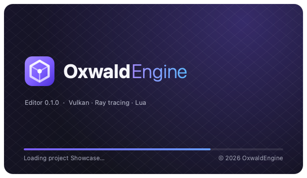

Сборка и запуск (macOS):

```sh
M="core;scene;rhi;assets;physics;animation;spline;audio;ai;net;script;async;world;gameplay;runtime;render;editor"
cmake --preset dev -B build/editor -DVCPKG_MANIFEST_INSTALL=OFF -DOX_MODULES="$M"
cmake --build build/editor --target OxwaldEditor
build/editor/bin/OxwaldEditor.app/Contents/MacOS/OxwaldEditor [--project MyGame.oxproj|<каталог>] [--browser]
```

Редактор собирается и с меньшим набором модулей (минимум `core;scene;editor`). Без модуля `render` вьюпорт работает в программном режиме, без `runtime` нет движка и Play идёт в упрощённой сессии.

| Параметр / переменная | Смысл |
| --- | --- |
| `--project <файл или каталог>` | Открыть проект сразу |
| `--browser` | Показать Project Browser |
| `--screenshots <каталог>` | Снять скриншоты для документации (вместе с `QT_QPA_PLATFORM=offscreen`) |
| `OX_EDITOR_NO_VULKAN` | Принудительно программный вьюпорт |
| `OX_EDITOR_PREFS_DIR` | Каталог Editor Preferences |

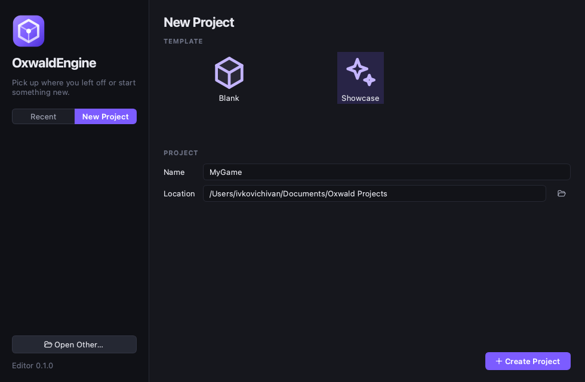

**Project Browser** имеет две вкладки. **Recent** показывает недавние проекты с датой открытия (отсутствующие на диске помечены «missing»). **New Project** создаёт проект. Шаблоны:

| Шаблон | Что внутри |
| --- | --- |
| **Blank** | Солнце, небо, камера и пол |
| **Showcase** | Небольшой демо-уровень: свет, пропсы, префабы, физика, скрипт, следование по сплайну, ИИ |

Кнопка **Open Other…** открывает любой `.oxproj` (или старый `.oxproject` — он конвертируется при открытии). Новый проект получает такую структуру:

```
MyGame/
  MyGame.oxproj        JSON ox::ProjectSettings + объект "editor" (данные только для редактора)
  Assets/              Scenes/ (Main.oxscene), Prefabs/, Materials/, Textures/, Meshes/, Scripts/, Audio/, AI/
  .oxcache/            импортированные артефакты AssetRegistry (в .gitignore)
  Saved/               раскладка окон, Autosaves/, thumbnail.png (в .gitignore)
  .gitignore
```

`startupScene` нового проекта — `project://Assets/Scenes/Main.oxscene`. Поля `.oxproj` описаны в [главе 05](05-runtime.md). Объект `"editor"` (описание, карты, сеть, скрипты, слои коллизий, конфигурация сборки) движок игнорирует.

## Шаг 2. Главное окно

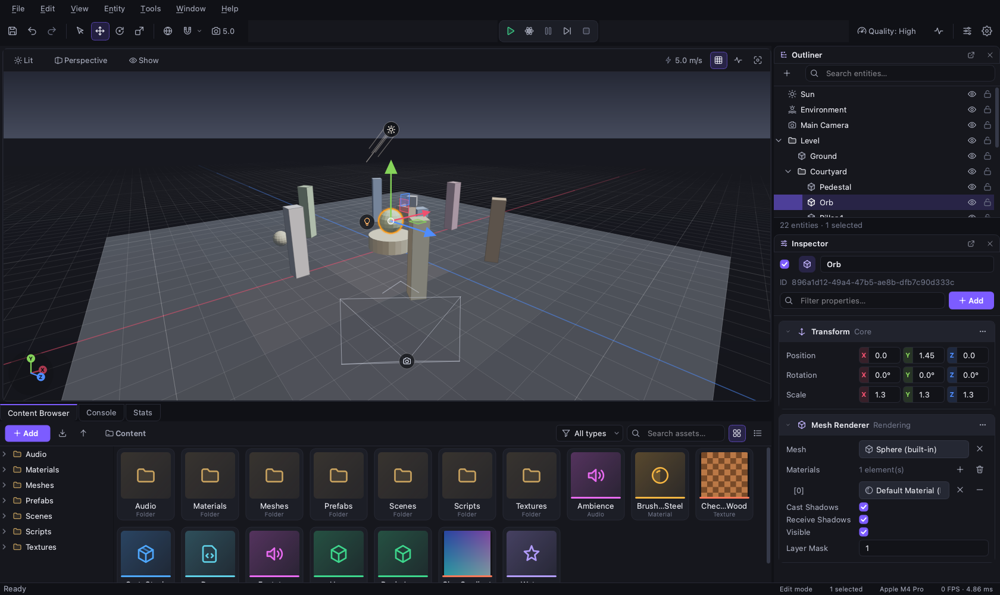

| Область | Что там |
| --- | --- |
| Меню | File, Edit, View, Entity, Tools, Window, Help |
| Панель инструментов, слева | Сохранить, Undo/Redo; режимы гизмо Select/Move/Rotate/Scale; World/Local; привязка (стрелка — шаги); скорость камеры |
| Панель инструментов, в центре | Play, Simulate, Pause, Advance One Frame, Stop |
| Панель инструментов, справа | **Quality: High** — быстрый выбор уровня качества, Auto-Detect, Scalability Settings…; Show Stats; Project Settings; Editor Preferences |
| Вьюпорт | Слева: режим отображения (Lit), проекция (Perspective), Show; справа: скорость камеры, сетка, статистика, фокус на выделении |
| Справа | Outliner и Inspector (док-панели) |
| Внизу | Вкладки Content Browser, Console, Stats, Coroutines, Behavior Tree |
| Строка состояния | Режим (Edit mode / Playing / Paused / Simulating), выделение, GPU (с пометкой `RT`, если трассировка доступна), FPS и время кадра вьюпорта |

Панели можно перетаскивать, объединять во вкладки и отрывать в отдельные окна. **Window → Save Layout** сохраняет раскладку для проекта, **Window → Reset Layout** возвращает исходную. Там же включаются скрытые панели, например **Scalability**.

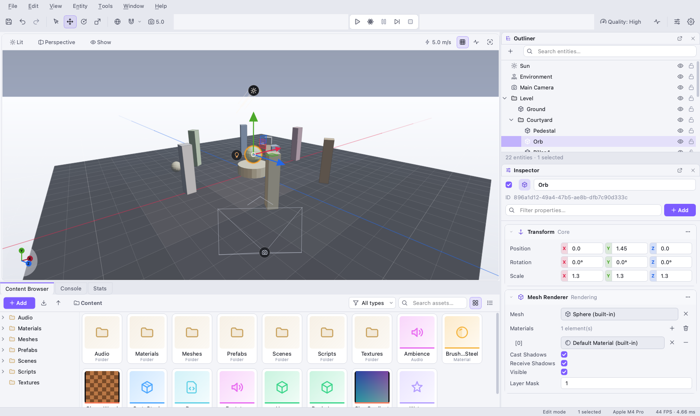

Тема (Dark/Light) переключается в **View → Theme** или в Editor Preferences → Appearance.

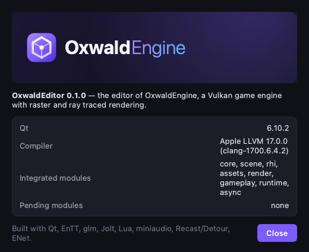

**Help → About OxwaldEditor** показывает версию Qt и компилятора и список модулей движка, с которыми собран редактор (Integrated modules). Если Play, вьюпорт или панель ведут себя не так, как описано в этой главе, сначала проверьте здесь, что нужный модуль (например, `render` или `gameplay`) подключён.

## Шаг 3. Вьюпорт и камера

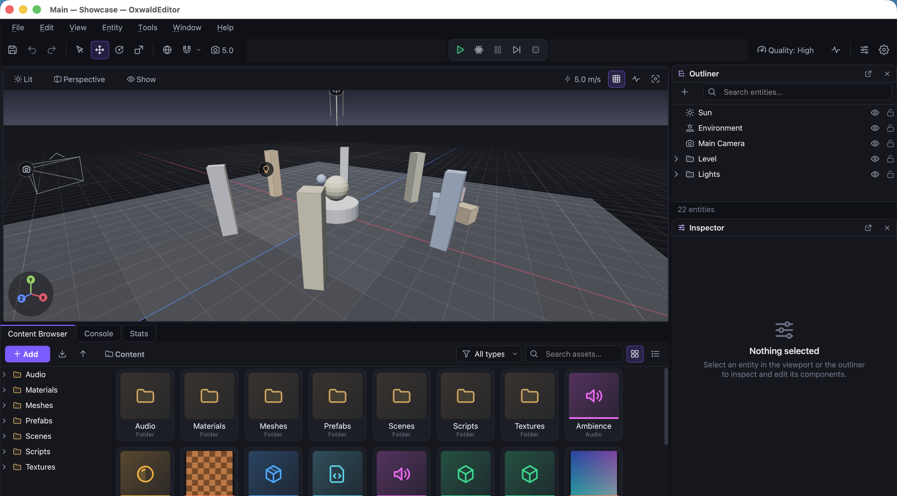

На macOS вьюпорт рисует настоящий рендерер движка через Vulkan (MoltenVK): тени, PBR-материалы, контур выделения. Тот же код рисует игру в OxwaldPlayer. Если Vulkan недоступен, редактор переключается на программный предпросмотр и пишет причину в строку состояния. Бэкенд выбирается в Preferences → Viewport → **Viewport Backend** (Auto / Software / Vulkan, применяется к новым вьюпортам). Сейчас Vulkan-поверхность есть только на macOS.

**Управление камерой:**

| Действие | Ввод |
| --- | --- |
| Полёт | Зажать ПКМ + WASD, E/Q — вверх/вниз, Shift — ×3 |
| Скорость полёта | Колесо мыши при зажатой ПКМ; меню скорости на панели инструментов (0.5–100 м/с) |
| Орбита вокруг точки | Alt + ЛКМ |
| Наезд (dolly) | Alt + ПКМ |
| Панорама | Средняя кнопка мыши |
| Приближение | Колесо мыши |
| Фокус на выделении | **F** |

Меню **Perspective** переключает перспективную и ортографическую проекцию, задаёт виды Top/Front/Right/Back, поле зрения и скорость камеры. Меню режима отображения (**Lit**) содержит Lit, Unlit, Wireframe, Lighting Only, World Normals, Overdraw (**Alt+1…Alt+6**), раздел Buffer Visualization (Base Color, Roughness, Metallic, Depth, Motion) и экспозицию: ручную EV100 или **Game Camera Exposure** (экспозиция основной камеры сцены).

**Show** — флаги отображения: Grid, Gizmos, Icons, Debug Draw, Bounds, Lights, Cameras, Fog, Shadows, Post Processing. Раздел **Gameplay Debug** включает отладочную отрисовку систем: Physics Colliders, Physics Contacts, Navigation Mesh, Splines, Skeletons, Audio Sources. Там же есть кнопка **Bake Navigation Mesh**.

**Show Stats** (**Ctrl+Shift+.**) выводит во вьюпорте FPS, время кадра, число сущностей и имя рендерера, например «Renderer: Vulkan (render)».

## Шаг 4. Выделение, гизмо и привязка

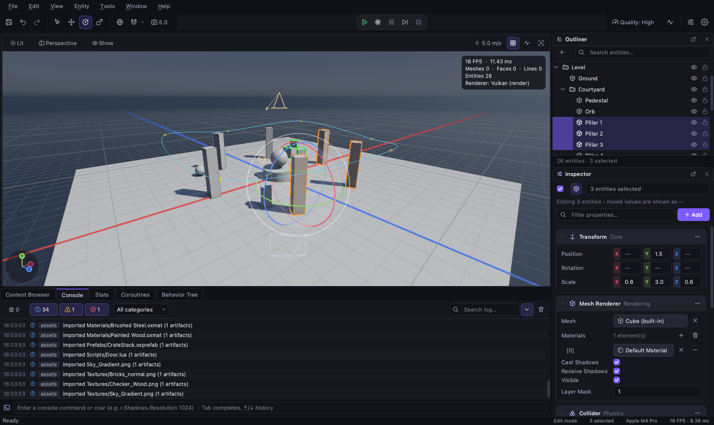

| Действие | Ввод |
| --- | --- |
| Выделить | ЛКМ по объекту (пикинг по ID-буферу рендерера) |
| Добавить к выделению | Shift + ЛКМ |
| Переключить объект в выделении | Ctrl (⌘) + ЛКМ |
| Выделить рамкой | Протянуть ЛКМ по пустому месту (с Shift/Ctrl — добавить) |
| Снять выделение, отменить перетаскивание, выйти из инструмента | Esc |
| Гизмо: выбор / перемещение / вращение / масштаб | **Q / W / E / R** |
| Мировые / локальные оси | **Ctrl+`** или кнопка на панели |

Гизмо работает со всеми выделенными объектами. Вращение и масштаб группы идут вокруг основного (последнего выделенного) объекта. Заблокированные в Outliner объекты не выделяются во вьюпорте и не двигаются.

**Привязка (snapping)** включается кнопкой с магнитом. Стрелка рядом с ней открывает выбор шага:

| Режим | Шаги в меню | По умолчанию |
| --- | --- | --- |
| Move | 0.01, 0.1, 0.25, 0.5, 1, 5, 10 м | 0.25 м |
| Rotate | 1°, 5°, 10°, 15°, 45°, 90° | 15° |
| Scale | ×0.05, ×0.1, ×0.25, ×0.5 | ×0.1 |

**Ctrl (на macOS — ⌘) во время перетаскивания инвертирует привязку**: при выключенной — временно включает, при включённой — выключает. Точные шаги задаются в Preferences → Viewport → Snapping.

## Шаг 5. Outliner

Outliner показывает иерархию мира. Кнопка **+** и контекстное меню создают сущности:

| Раздел | Что создаётся |
| --- | --- |
| — | Empty |
| Shapes | Cube, Sphere, Cylinder, Plane |
| Lights | Directional, Point, Spot, Area Light |
| Other | Camera, Environment |

У каждой строки есть «глаз» (видимость только во вьюпорте редактора) и «замок» (запрет выделения во вьюпорте). Перетаскивание строк меняет родителя. Контекстное меню: Create/Create Child, Rename (**F2**), Duplicate (**Ctrl+D**), Copy/Cut/Paste, Unparent, Create Prefab…, Delete. Внизу панели — счётчик «26 entities · 1 selected». Во время игры к нему добавляется «play world». Экземпляры префабов подсвечены акцентным цветом.

Меню **Entity** повторяет создание (Create, Create Child) и содержит команды префабов (шаг 8).

## Шаг 6. Inspector

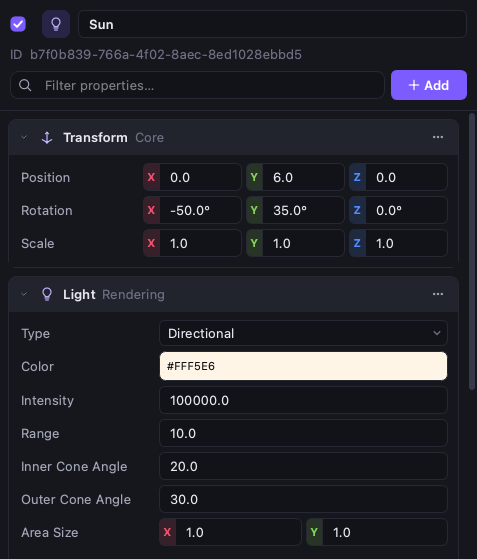

Инспектор строится по рефлексии ([глава 02](02-reflection-serialization.md)), поэтому компоненты любого модуля редактируются без отдельного кода. Вверху — флажок **Active** (неактивная сущность и её дети пропускаются геймплеем и рендером), иконка, имя и UUID. Ниже — фильтр свойств и кнопка **+ Add**.

Компоненты показаны карточками. Заголовок карточки — имя и категория (Core, Rendering, Physics…). Меню **⋯** содержит Reset to Defaults, Copy Values, Paste Values, Remove Component. Массивы редактируются кнопками + / корзина / −, словари — Add Entry, `optional` — флажком Set. Правый щелчок по свойству даёт Reset to Default, Copy Property Path и, для экземпляров префабов, Revert to Prefab.

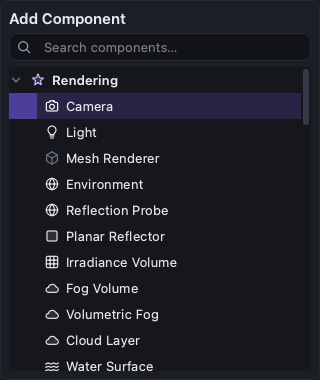

**Add Component** — поиск по категориям (Rendering, Physics, Audio, AI, Scripting…). Компоненты, которые уже есть у выделения, недоступны.

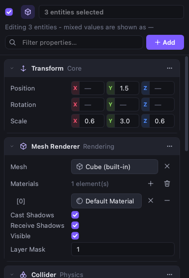

При выделении нескольких сущностей инспектор редактирует их вместе («Editing 3 entities»). Различающиеся значения показаны как **—**. Новое значение записывается во все сущности одной командой undo.


**Свойства скрипта.** Карточка Script показывает свойства, объявленные в Lua (`properties = { ... }`, [глава 15](15-scripting-lua.md)), как типизированные поля с диапазонами и подсказками. Изменённое значение — это override в `Script.properties`: слева от поля появляется акцентная метка, а в контекстном меню — пункт Reset to Script Default. Кнопка `</>` открывает скрипт во внешнем редакторе.

Другие карточки с дополнительными кнопками:

| Компонент | Кнопки |
| --- | --- |
| Collider | **Fit to Mesh** — подогнать коллайдер под границы меша |
| NavMeshSurface | **Bake** и размер запечённых данных |
| BehaviorTree | **Open Behavior Tree Debugger** |
| Spline | **Edit Points** (шаг 12) |
| Terrain | **Sculpt** (шаг 12) |

## Шаг 7. Undo/redo и правки

Панели не меняют мир напрямую. Каждая правка (свойство, создание, удаление, дублирование, перенос в иерархии, добавление компонента, вставка, операции с префабами) становится командой в стеке undo. Перетаскивание гизмо или слайдера записывается **одной** командой от нажатия до отпускания. Правки ключуются по UUID, поэтому история переживает перезапуск движка при смене проекта.

| Команда | Клавиши |
| --- | --- |
| Undo / Redo | **Ctrl+Z** / **Ctrl+Y** (на macOS ⌘Z / ⌘Y) |
| Cut / Copy / Paste | **Ctrl+X / C / V** |
| Duplicate | **Ctrl+D** |
| Delete | **Del** (в Content Browser — и Backspace) |
| Rename | **F2** |
| Select All | **Ctrl+A** |

Во время Play правки идут прямо в play world и в стек undo не попадают. Stats показывает размер стека («Undo stack: N commands»).

## Шаг 8. Префабы и overrides

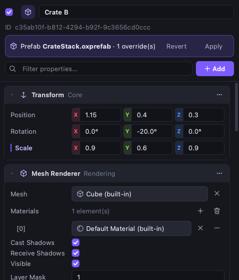

| Действие | Где |
| --- | --- |
| Создать префаб из выделения | Entity → **Create Prefab from Selection…** или Outliner → Create Prefab… (`.oxprefab` или `.oxprefab.json`) |
| Поставить экземпляр | Entity → **Instantiate Prefab…**, перетаскивание префаба из Content Browser во вьюпорт или Outliner, контекстное меню ассета → Place in Scene |
| Записать изменения экземпляра в префаб | Кнопка **Apply** в баннере инспектора или Entity → Apply Changes to Prefab |
| Сбросить все overrides | **Revert** в баннере или Entity → Revert All Overrides |
| Сбросить одно поле | Правый щелчок по полю → Revert to Prefab |

Баннер инспектора показывает префаб и число overrides («Prefab CrateStack.oxprefab · 1 override(s)»). Изменённые поля отмечены акцентной полосой (на скриншоте — Scale). Как устроены префабы и overrides в данных, описано в [главе 03](03-ecs-scene.md).

## Шаг 9. Content Browser и импорт ассетов

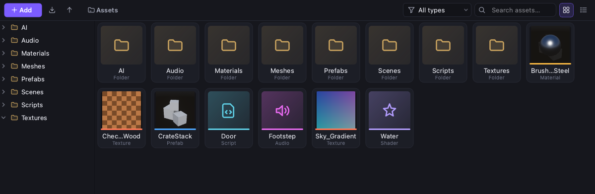

Content Browser показывает папку `Assets/` проекта поверх базы ассетов (`AssetRegistry`). Под миниатюрой — имя и тип, цветная полоса тоже обозначает тип. Справа вверху — фильтр по типу, поиск и переключатель плитки/списка.

| Действие | Как |
| --- | --- |
| Импорт | Перетащить файлы из Finder, кнопка импорта или Add → **Import…** (glTF/GLB, FBX, OBJ, PNG, JPG, TGA, BMP, PSD, KTX2, EXR, HDR, WAV, OGG, MP3, FLAC, Lua, TTF/OTF) |
| Новый ассет | **+ Add**: New Folder, Scene, Prefab, Material (`.oxmat`), Lua Script (шаблон с объявленными свойствами), Behavior Tree (`.oxbt`) |
| Открыть сцену | Двойной щелчок |
| Переимпорт | Контекстное меню → **Reimport** или кнопка в инспекторе ассета |
| Переименовать / переместить | F2 или перетаскивание. `.meta` переносится вместе с файлом, UUID сохраняется |
| Удалить | Del. Если на ассет кто-то ссылается, редактор перечисляет ссылки, которые сломаются |
| Прочее | Copy Path, Show in Finder, Refresh |

Ошибки импорта показываются в строке состояния. Миниатюры кэшируются в `.oxcache/thumbnails/<uuid>.png`. Меши, модели, префабы и материалы рендерятся в offscreen-предпросмотре.

**Перетаскивание из Content Browser:**

| Что тянем | Куда | Результат |
| --- | --- | --- |
| Model / Prefab | Вьюпорт или Outliner | Экземпляр префаба |
| Mesh | Вьюпорт | Сущность с MeshRenderer |
| Material | Объект во вьюпорте | Первый слот материала этого объекта |
| Script | Сущность | Компонент Script |
| Любой ассет | Поле ассета в инспекторе | Ссылка, если тип совместим (модель на поле меша — её первый меш) |

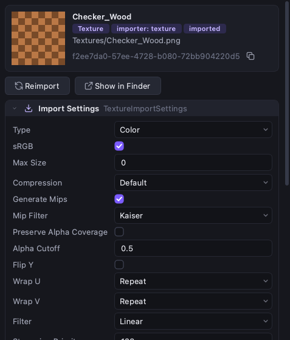

Выбранный ассет открывается в **инспекторе ассета**: заголовок с типом, импортёром, путём и UUID, кнопки **Reimport** и **Show in Finder**. Настройки импорта (`TextureImportSettings`, `ModelImportSettings`, `HeightmapImportSettings`) применяются кнопкой **Apply & Reimport**. Ниже — статистика импорта, подассеты, зависимости и список «используется в». Подробно об импорте — в [главе 31](31-assets.md).

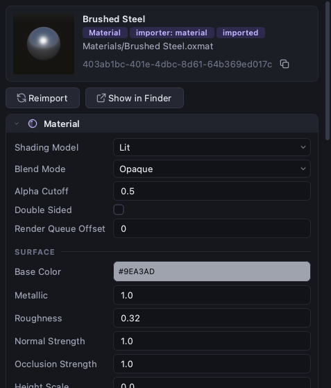

Для материала `.oxmat` инспектор показывает значения `MaterialAsset`: Shading Model, Blend Mode, Alpha Cutoff, Base Color, Metallic, Roughness, … Изменения записываются кнопкой Save. Параметры материалов описаны в [главе 19](19-materials.md).

## Шаг 10. Play-in-Editor и Simulate

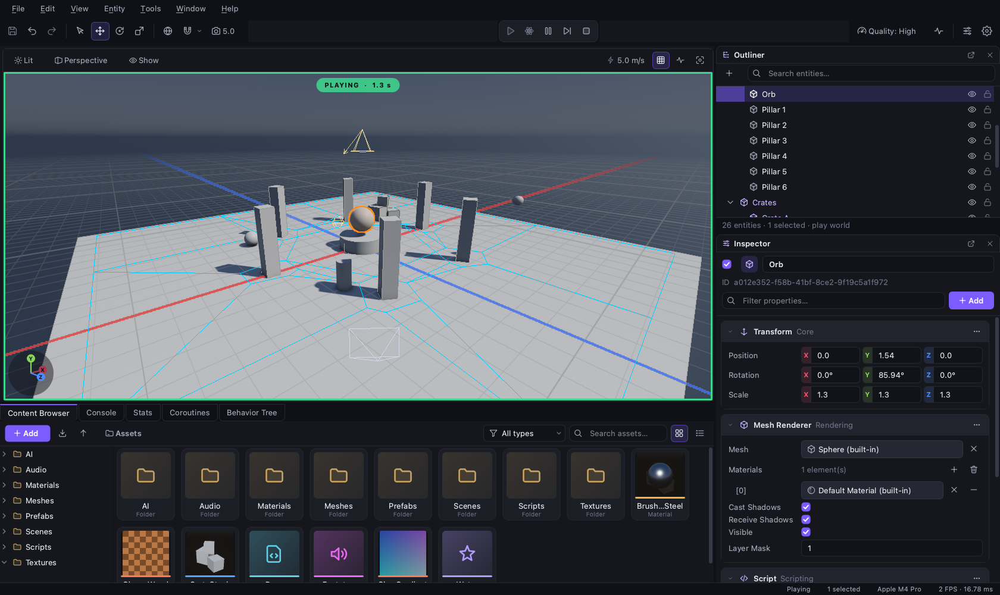

| Кнопка | Клавиши | Что делает |
| --- | --- | --- |
| **Play** | **Alt+P** | Клон мира + все игровые системы. Ввод идёт в игру |
| **Simulate** | **Alt+S** | Клон мира: работают физика, анимация и мир; скрипты, ИИ, восприятие, навигация, сеть и следование по сплайну выключены. Ввод в игру не захватывается |
| **Pause** | Pause | Кадры идут с dt = 0, можно осматривать сцену |
| **Advance One Frame** | — | Один кадр и один фиксированный шаг |
| **Stop** | **Shift+Esc**; **Esc** во вьюпорте | Вернуться к edit world. Он не менялся |

В режиме Play вьюпорт обведён зелёной рамкой, сверху висит плашка «PLAYING · 1.3 s», а в Outliner виден play world. **Щелчок во вьюпорт захватывает мышь**: курсор скрыт, клавиши, кнопки, колесо и движение мыши идут в `InputSystem` игры. **Shift+F1** отпускает мышь (редакторская камера снова работает, щелчок захватывает мышь опять), **Esc** останавливает игру. Во время игры недоступны Save, Save As, New Scene и Open Scene.

Ошибки Lua попадают в консоль как `файл.lua:42`. Это ссылки: они открывают файл во внешнем редакторе из Preferences → Source Control & Tools (аргументы `"%f":%l`) или в системном приложении.

В режиме редактирования движок тоже тикает: работают отладочная отрисовка, ландшафт, предпросмотр анимации и hot reload ассетов (`AssetRegistry::poll`).

## Шаг 11. Консоль, Stats и отладочные панели

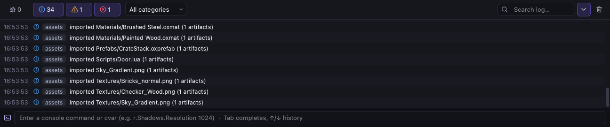

**Console** (**`** — открыть и поставить фокус в поле ввода) показывает лог со счётчиками и фильтрами по уровню (Debug, Info, Warnings, Errors), фильтр категорий, поиск, автопрокрутку и очистку. Поле ввода принимает cvar'ы (`r.Shadows.Resolution 1024`) и команды движка ([глава 04](04-cvars-quality.md)), **Tab** дополняет, **↑/↓** листают историю. Команда `quit` останавливает Play.

**Stats** — плитки Frame rate, Frame time, Memory (RSS), Entities; график времени кадра; таблица систем (CPU, в Play/Simulate); GPU-пассы рендерера; размер стека undo.

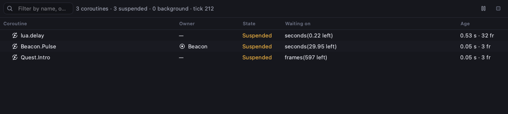

**Coroutines** обновляется 4 раза в секунду (каждые 250 мс) и показывает:

| Колонка | Смысл |
| --- | --- |
| Coroutine | Имя (вложенные корутины — дочерние строки) |
| Owner | Сущность-владелец. Двойной щелчок выделяет её |
| State | Suspended, Running, … |
| Waiting on | Чего ждёт: `seconds(0.22 left)`, `frames(597 left)` |
| Age | Игровое время и кадры, в подсказке — реальное время |

Сверху — фильтр, сводка («3 coroutines · 3 suspended · 0 background · tick 212»), «заморозка» списка и отмена выбранных. **Корутины без владельца отменить из редактора нельзя.** Корутины описаны в [главе 08](08-coroutines.md).

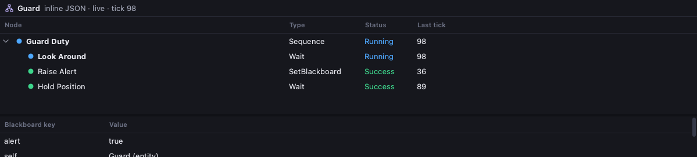

**Behavior Tree** показывает дерево выделенной сущности. Во время игры видны живые статусы узлов (Running/Success/Failure, жирным — узлы, тикнувшие в этом кадре), номер последнего тика и blackboard (ссылки на сущности показаны именами). В режиме редактирования видна структура дерева. Behavior trees описаны в [главе 13](13-ai.md).

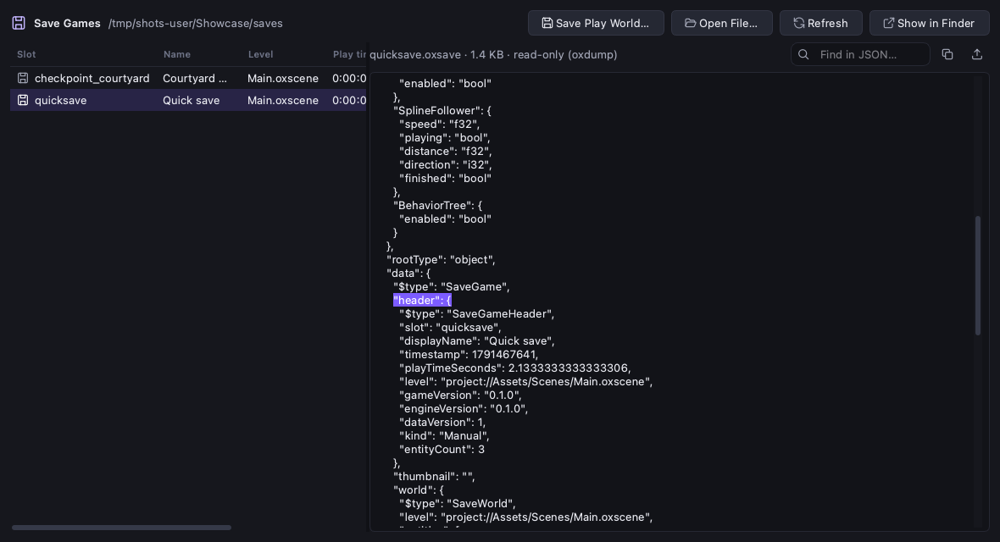

**Tools → Save Game Inspector…** показывает слоты `SaveGameSystem::listSlots()`: имя, уровень, время игры, дату, размер и флаги. Выбранный слот декодируется в JSON (как `oxdump`), только для чтения, с поиском, копированием и экспортом. **Open File…** открывает произвольный файл сохранения. Во время игры доступна кнопка **Save Play World…**. Сохранения описаны в [главе 07](07-savegames.md).

## Шаг 12. Сплайны и ландшафт

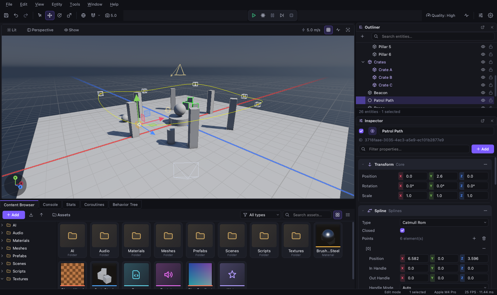

**Сплайн.** Выделите сущность с компонентом Spline и нажмите **Edit Points** в карточке.

| Действие | Ввод |
| --- | --- |
| Выбрать точку | Щелчок по точке; гизмо перемещает её |
| Вставить точку после выбранной | Ctrl + щелчок |
| Удалить точку | Del или Backspace |
| Выйти из инструмента | Esc |

Все операции записываются в undo. Тип сплайна, замкнутость и точки с ручками In/Out и Handle Mode редактируются в карточке Spline. Сами сплайны описаны в [главе 11](11-splines.md).

**Ландшафт.** Кнопка **Sculpt** в карточке Terrain включает кисть. Режимы — Raise, Lower, Smooth, Flatten, параметры — радиус R (0.5–200 м) и сила S.

| Действие | Ввод |
| --- | --- |
| Рисовать | ЛКМ |
| Сглаживать | Shift + ЛКМ |
| Опускать | Ctrl + ЛКМ |
| Радиус кисти | Ctrl + колесо |

Кисть рисуется кольцом поверх каркаса ландшафта. **Правки ландшафта живут только в `WorldRuntime`**: пересборка компонента их сбрасывает, а записи карты высот в ассет пока нет. Ландшафт описан в [главе 16](16-world.md).

## Шаг 13. Project Settings

**Edit → Project Settings…** (**Ctrl+Alt+,**). Всё, что здесь задано, хранится в `.oxproj` и попадает в игру. Слева — поиск по всем страницам: он оставляет только страницы и строки с совпадениями. Внизу — Undo/Redo правок, **Revert** и **Apply**. Apply сохраняет файл и сразу передаёт в запущенный движок привязки ввода и гравитацию.

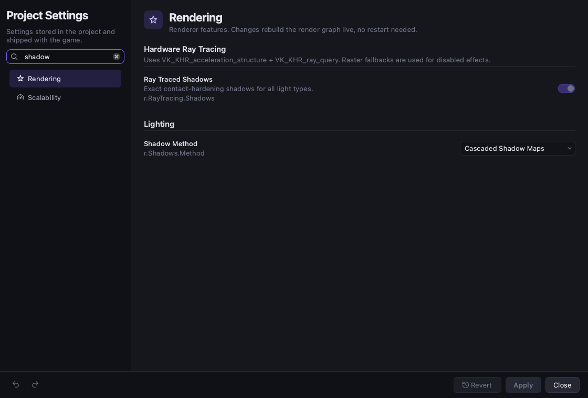

| Страница | Что настраивается |
| --- | --- |
| General | Имя, версия (пишется в заголовки сохранений), компания, описание, Save Game Version, стартовая сцена, модули движка (Asset Database, Physics, Audio, Scripting, Coroutines, AI, Networking, World, Gameplay — применяются после переоткрытия проекта) |
| Maps & Modes | Editor Startup Map, Game Default Map, Default Game Mode |
| Packaging | Конфигурация (Development / Shipping), каталог вывода, сжатие pak (zstd), отладочные файлы, целевые платформы (macOS, Windows, Linux), Always Include |
| Rendering | Трассировка лучей, сглаживание и апскейл, тонмаппинг и экспозиция, методы освещения, VSync и лимит FPS (ниже) |
| Scalability | Уровни качества по группам (ниже) |
| Physics | Гравитация, частота фиксированного шага, макс. подшагов, макс. тел, слои и матрица коллизий |
| Audio | Громкость шин, частота дискретизации, максимум голосов |
| Input | Действия и привязки контекста по умолчанию |
| Networking | Порт, макс. клиентов, частота снапшотов, задержка интерполяции |
| Scripting | Hot reload и песочница Lua |

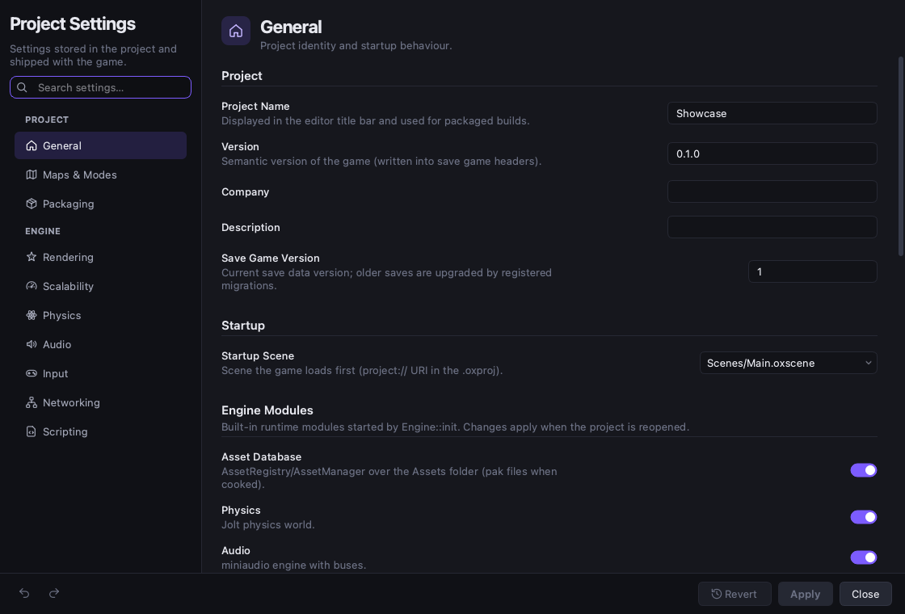

### Rendering

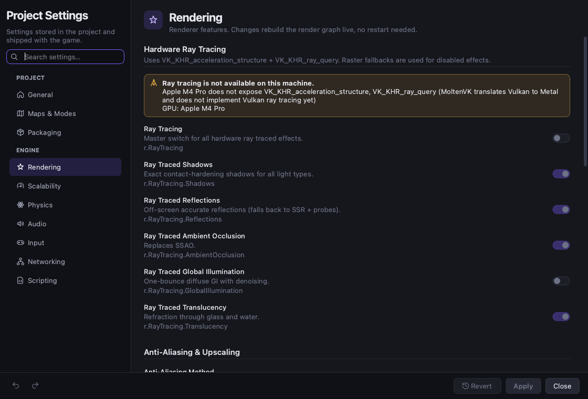

Изменения на этой странице перестраивают render graph на лету, перезапуск не нужен.

| Раздел | Настройка | CVar |
| --- | --- | --- |
| Hardware Ray Tracing | Ray Tracing (главный выключатель) | `r.RayTracing` |
| | Ray Traced Shadows / Reflections / Ambient Occlusion / Global Illumination / Translucency | `r.RayTracing.Shadows`, `.Reflections`, `.AmbientOcclusion`, `.GlobalIllumination`, `.Translucency` |
| Anti-Aliasing & Upscaling | Anti-Aliasing Method (None, FXAA, TAA) | `r.AntiAliasing` |
| | Upscaler (Off, FSR1, DLSS, TAAU) | `r.Upscaler` |
| | Upscaler Quality: Ultra Performance 33 %, Performance 50 %, Balanced 58 %, Quality 67 %, DLAA/Native 100 % | `r.Upscaler.Quality` |
| | Sharpness (RCAS для FSR, sharpness для DLSS) | `r.Upscaler.Sharpness` |
| Tonemapping & Exposure | Tonemapper (ACES, AgX), Default Exposure (EV), Auto Exposure | `r.Tonemapper`, `r.Exposure.Default`, `r.Exposure.Auto` |
| Lighting | Shadow Method, Global Illumination Method, Reflection Method | `r.Shadows.Method`, `r.GI.Method`, `r.Reflections.Method` |
| Display | VSync, Frame Rate Limit (0 = без ограничения) | `r.VSync`, `r.MaxFPS` |

Доступность берётся из `DeviceCaps` устройства. Если трассировка не поддерживается, сверху появляется баннер с причиной и GPU (на Apple M4 Pro: MoltenVK не реализует `VK_KHR_acceleration_structure` и `VK_KHR_ray_query`). Переключатели RT в этом случае неактивны, RT-варианты в списках Shadow/GI/Reflection Method отключены с подсказкой. Отдельные RT-эффекты активны только при включённом `r.RayTracing`. Если DLSS недоступен, он отключён в списке, а ниже выводится баннер с причиной. Quality и Sharpness неактивны, пока апскейлер выключен. Подробно об этих методах — в главах [20](20-lighting-shadows.md), [24](24-ray-tracing.md) и [25](25-upscalers-postprocess.md).

### Scalability

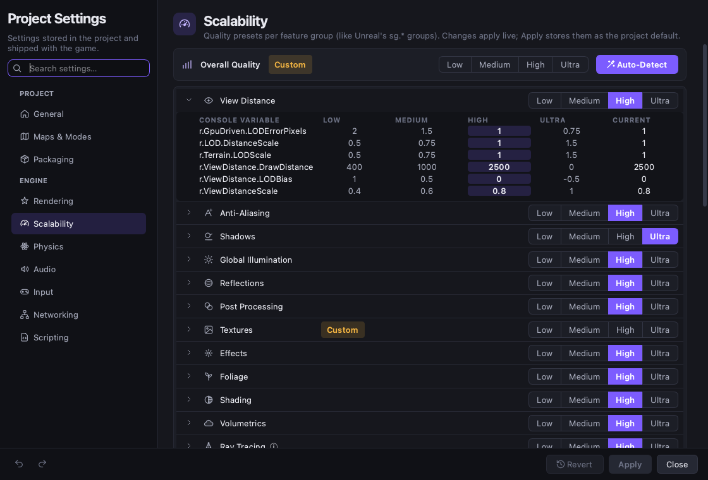

Страница работает как группы `sg.*` в Unreal. **Overall Quality** задаёт уровень всем группам (Low / Medium / High / Ultra). Если группы различаются, рядом появляется пометка **Custom**. У каждой группы свой выбор уровня. Если развернуть группу, видна таблица её cvar'ов со значениями для Low/Medium/High/Ultra и текущим значением. Пометка Custom у группы означает, что её cvar'ы изменены вручную. Группы: View Distance, Anti-Aliasing, Shadows, Global Illumination, Reflections, Post Processing, Textures, Effects, Foliage, Shading, Volumetrics, Ray Tracing.

Пример таблицы группы View Distance со скриншота:

| CVar | Low | Medium | High | Ultra |
| --- | --- | --- | --- | --- |
| `r.GpuDriven.LODErrorPixels` | 2 | 1.5 | 1 | 0.75 |
| `r.LOD.DistanceScale` | 0.5 | 0.75 | 1 | 1.5 |
| `r.Terrain.LODScale` | 0.5 | 0.75 | 1 | 1.5 |
| `r.ViewDistance.DrawDistance` | 400 | 1000 | 2500 | 0 |
| `r.ViewDistance.LODBias` | 1 | 0.5 | 0 | −0.5 |
| `r.ViewDistanceScale` | 0.4 | 0.6 | 0.8 | 1 |

Изменения применяются сразу. **Apply** сохраняет их как значения проекта по умолчанию: `defaultQuality` + `scalability`, а если группы различаются — `Custom` и уровни по группам. **Auto-Detect** запускает `render::autoDetectQuality` на устройстве вьюпорта (или на временном headless-устройстве) и выставляет уровни по результату бенчмарка. То же доступно из меню **Quality** на панели инструментов, из **Tools → Auto-Detect Quality** и в док-панели **Scalability**. Подробности — в главах [04](04-cvars-quality.md) и [26](26-quality-settings.md).

### Physics и Input

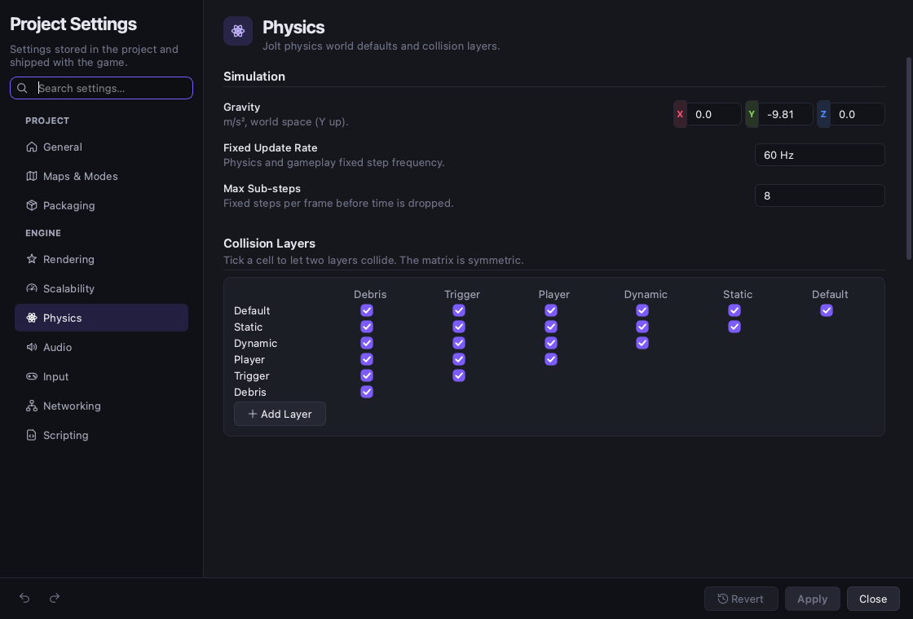

Physics: гравитация (на скриншоте (0, −9.81, 0) м/с²), Fixed Update Rate (60 Hz), Max Sub-steps (8), Max Bodies (65536) и симметричная матрица слоёв коллизий (Default, Static, Dynamic, Player, Trigger, Debris; кнопка Add Layer). См. [главу 09](09-physics.md).

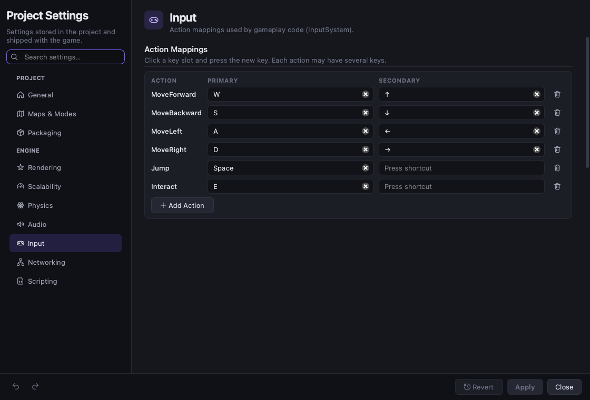

Input: таблица **Actions** (имя, тип значения Bool/Axis1D/Axis2D/Axis3D, описание) и таблица **Bindings** контекста по умолчанию. Источник привязки задаётся как `Key.<Имя>`, `Mouse.Left/Right/Middle/X/Y/XY/Wheel` или `Gamepad.A/B/…/LeftStick/RightStick/LeftTrigger`. Чтобы назначить клавишу, щёлкните поле Key и нажмите её. Модификаторы и триггеры (Negate, Swizzle, DeadZone, Down…) отображаются и сохраняются, но редактируются только в `.oxproj`. Редактируется только первый контекст. См. [главу 06](06-input.md).

## Шаг 14. Editor Preferences

**Edit → Editor Preferences…** (на macOS **⌘,**). Это личные настройки: они хранятся в `EditorPreferences.json` в каталоге пользователя (на macOS `~/Library/Application Support/OxwaldEditor`) и не попадают в проект.

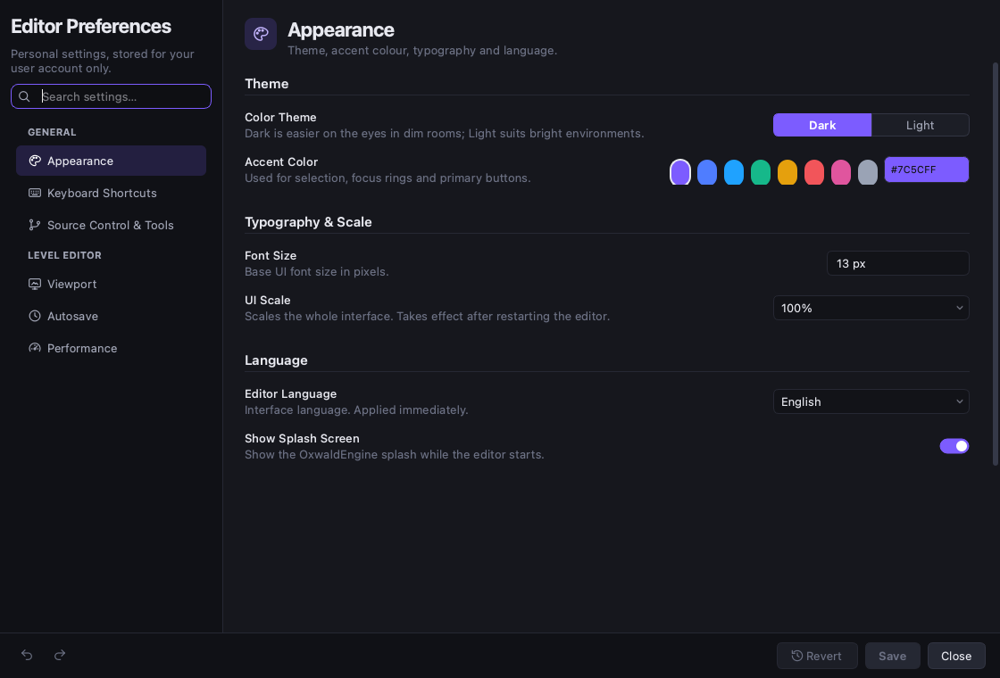

| Страница | Настройки (по умолчанию) |
| --- | --- |
| Appearance | Тема Dark/Light, акцентный цвет, размер шрифта (13 px), UI Scale (100 %, после перезапуска), язык (English / Русский, сразу), заставка |
| Keyboard Shortcuts | Переназначение команд, конфликты подсвечиваются, кнопка сброса к умолчанию |
| Source Control & Tools | Провайдер None / Git / Perforce; внешний редактор кода и аргументы (`"%f":%l`) |
| Viewport | Камера: скорость 5 м/с, ускорение 4, FOV 60°, чувствительность 0.25 °/px, инверсия Y. Сетка 1 м, размер гизмо 1, цвет контура выделения. Привязка: 0.25 м, 15°, 0.1. Viewport Backend: Auto |
| Autosave | Включён, каждые 5 минут (только при несохранённых изменениях), хранить 5 копий в `Saved/Autosaves` |
| Performance | Лимит кадров редактора 120 (0 = без ограничения), снижать частоту без фокуса до 10 FPS |
| Game User Settings | `UserSettings` игры (ниже) |

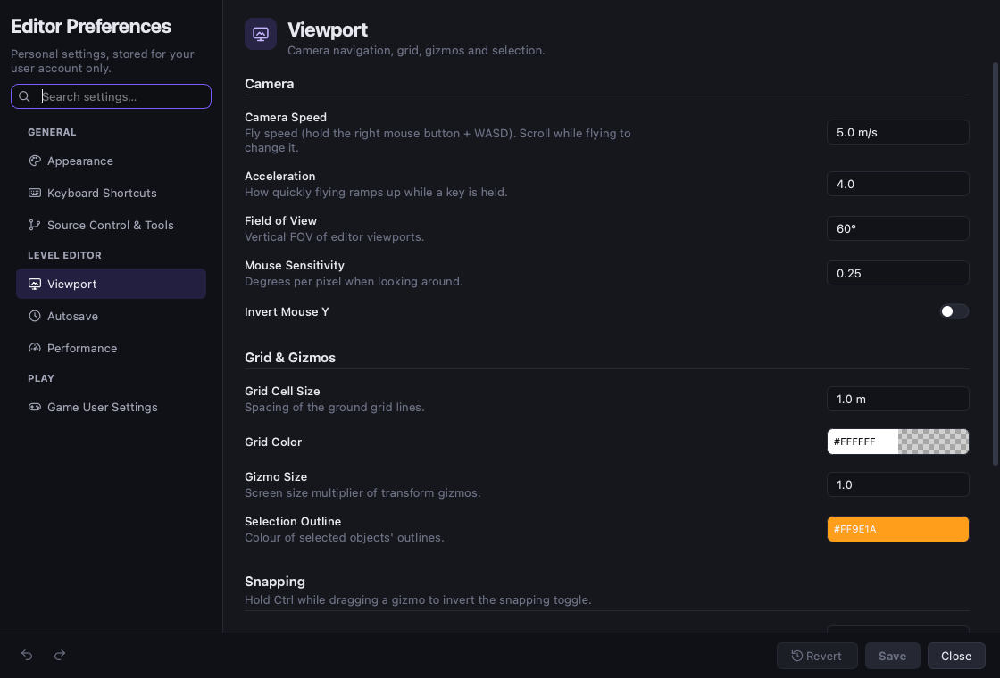

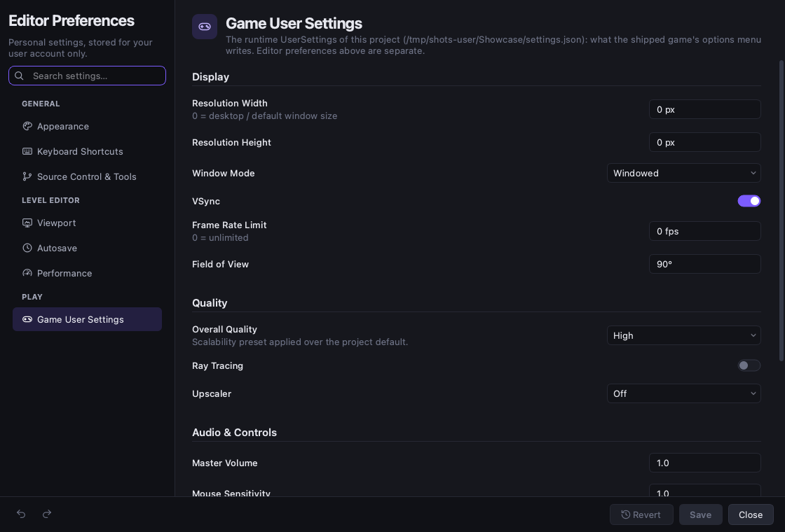

**Game User Settings** редактирует не редактор, а пользовательские настройки игры этого проекта (`user://settings.json`) — то, что записывает меню настроек в собранной игре ([глава 29](29-ui.md)). Разделы: Display (разрешение, режим окна, VSync, лимит FPS, FOV), Quality (общий уровень поверх значения проекта, RT, апскейлер), Audio & Controls (громкость, чувствительность мыши, инверсия Y, язык). Кнопка «Apply to Editor Session» применяет их к текущей сессии (`Settings::apply`).

## Шаг 15. Горячие клавиши

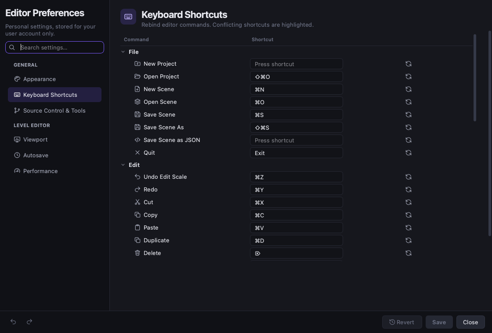

Значения по умолчанию из `MainWindow::createActions` и `ViewportPanel`. На macOS Ctrl означает ⌘.

| Команда | Клавиши |
| --- | --- |
| Open Project… | Ctrl+Shift+O |
| New Scene / Open Scene… / Save Scene | Ctrl+N / Ctrl+O / Ctrl+S |
| Save Scene As… | Ctrl+Shift+S |
| Quit | системное (⌘Q) |
| Undo / Redo | Ctrl+Z / Ctrl+Y |
| Cut / Copy / Paste / Duplicate | Ctrl+X / Ctrl+C / Ctrl+V / Ctrl+D |
| Delete / Rename / Select All | Del / F2 / Ctrl+A |
| Editor Preferences… / Project Settings… | ⌘, / Ctrl+Alt+, |
| Play / Simulate / Pause / Stop | Alt+P / Alt+S / Pause / Shift+Esc |
| Select / Move / Rotate / Scale | Q / W / E / R |
| World / Local Space | Ctrl+` |
| Focus Selection | F |
| Show Stats | Ctrl+Shift+. |
| Режимы отображения Lit … Overdraw | Alt+1 … Alt+6 |
| Console | ` |
| Documentation | F1 |
| В Play: отпустить мышь / остановить | Shift+F1 / Esc |

Команды без клавиш по умолчанию (New Project, Save Scene as JSON, Advance One Frame, Snapping, Auto-Detect Quality, Save Game Inspector, Bake Navigation Mesh и др.) можно назначить на этой же странице.

## Шаг 16. Расширение редактора на C++

Редактор устроен так, что компоненты любого модуля редактируются без кода — через рефлексию. Когда этого мало, есть точки расширения (сигнатуры из `editor/src/`):

| Что | Как |
| --- | --- |
| Своя панель | `QWidget`, принимающий `EditorContext*`. Слушает `structureChanged` / `propertiesChanged` / `worldReset` / `Selection::changed`, регистрируется в `MainWindow::createDocks` через `makeDock(objectName, title, icon, widget)` |
| Кнопки под карточкой компонента | `ComponentExtensions::add("MyComponent", ComponentExtension{hiddenFields, footer})`, где `footer(EditorContext*, const UuidList&, QWidget*)` возвращает наследника `ComponentExtensionWidget` (виртуальный `refresh()` вызывается вместе с карточкой) |
| Свой редактор поля | `PropertyEditorFactory::registerEditor(priority, predicate, creator)`: `predicate(const reflect::TypeInfo&, const reflect::Attributes&)`, `creator(const PropertyContext&, QWidget*)` |
| Страница настроек | `SettingsPage` + `addToggle/addCombo/addNumber/…` с привязкой `cvarBinding`, `projectBinding` (пути в `.oxproj`, данные редактора — под `editor.`) или своей `SettingBinding` |
| Иконка | SVG 24×24 со `stroke="currentColor"` в `editor/resources/icons/` |
| Перевод | `tr()` + `editor/src/i18n/translations_ru.cpp` |

Правки из своих панелей делайте только через `EditorContext` (`setProperty(ids, "Light", "intensity", value, phase)`, `createEntities`, `deleteEntities`, `addComponent`…), иначе они не попадут в undo и не будут работать во время Play.

Интерфейсы, через которые редактор подключает модули движка:

| Интерфейс | Реализация |
| --- | --- |
| `IViewportRenderer` (через `EditorServices::setViewportRendererFactory`) | `render::EditorViewportAdapter` |
| `IThumbnailRenderer` | offscreen-предпросмотр рендера |
| `IQualityBenchmark` | `render::autoDetectQuality` (эвристика без устройства) |
| `IRenderingCapsProvider` | `DeviceCaps` из rhi |
| `IAssetBackend` | `RegistryAssetBackend` (`FileSystemAssetBackend` без модуля assets) |
| `IPlayRuntime` | `GameplayPlayRuntime` |

Пример готового расширения — `editor/src/integration/gameplay_inspector.cpp`: кнопки Fit to Mesh, Bake, Edit Points и Sculpt.

## Типичные ошибки и подводные камни

- **Правки во время Play пропали.** Так и задумано: Play и Simulate работают на клоне, edit world не меняется. Нужное значение запомните и повторите после Stop или скопируйте компонент (⋯ → Copy Values, после Stop → Paste Values).
- **Мышь «застряла» в игре.** Щелчок во вьюпорт в режиме Play захватывает ввод. Shift+F1 отпускает мышь, Esc останавливает игру.
- **Esc остановил игру, а нужно было меню паузы.** В режиме Play Esc во вьюпорте перехватывает редактор. Проверяйте меню паузы в OxwaldPlayer или назначьте игре другую клавишу.
- **Правки ландшафта исчезли.** Sculpt меняет данные только в `WorldRuntime`. Пересборка компонента или перезапуск сбрасывают их.
- **Корутину нельзя отменить.** У корутины нет владельца-сущности. Запускайте игровые корутины с владельцем.
- **Включить RT не получается.** На этой машине нет аппаратной трассировки (например, macOS/MoltenVK). Причина видна в баннере на странице Rendering и в подсказке строки состояния.
- **Модуль выключен в General, а он всё ещё работает.** Список модулей применяется при следующем открытии проекта.
- **Настройки «не сохранились в игре».** Editor Preferences — личные и в игру не попадают. Настройки игры задаются в Project Settings (`.oxproj`), а настройки игрока — в Game User Settings (`user://settings.json`).
- **Ассет переименован в Finder и ссылки сломались.** Переименовывайте и перемещайте ассеты в Content Browser: `.meta` с UUID должен переезжать вместе с файлом.
- **Модификаторы привязки не редактируются.** Страница Input показывает и сохраняет модификаторы и триггеры, но менять их можно только в `.oxproj`. Редактируется только первый контекст.
- **Нет Vulkan-вьюпорта на Linux/Windows.** Vulkan-поверхность пока сделана только для macOS, на других платформах вьюпорт программный.

## API

| Файл | Что внутри |
| --- | --- |
| [`core/editor_context.hpp`](../../editor/src/core/editor_context.hpp) | `EditorContext`: движок, мир, выделение, undo, префабы, буфер обмена |
| [`core/project.hpp`](../../editor/src/core/project.hpp) | `Project`: создание, открытие, настройки `.oxproj` |
| [`core/preferences.hpp`](../../editor/src/core/preferences.hpp) | `PreferenceValues`, `EditorPreferences` |
| [`core/commands.hpp`](../../editor/src/core/commands.hpp) | Команды undo: `SetPropertyCommand`, `CreateEntitiesCommand`, … |
| [`inspector/component_extensions.hpp`](../../editor/src/inspector/component_extensions.hpp) | `ComponentExtensions`, `ComponentExtension`, `ComponentExtensionWidget` |
| [`inspector/property_editors.hpp`](../../editor/src/inspector/property_editors.hpp) | `PropertyEditorFactory`, `PropertyEditor` |
| [`settings/settings_dialog.hpp`](../../editor/src/settings/settings_dialog.hpp) | `SettingsPage`, `SettingBinding`, `cvarBinding`, `projectBinding` |
| [`viewport/viewport_renderer.hpp`](../../editor/src/viewport/viewport_renderer.hpp) | `IViewportRenderer`, `ViewMode`, `ShowFlags`, `ViewportCamera` |
| [`shell/main_window.cpp`](../../editor/src/shell/main_window.cpp) | Меню, панели, горячие клавиши по умолчанию |

Заметки для разработчиков редактора (устройство, тесты, ограничения): [`docs/dev/modules/editor.md`](../dev/modules/editor.md).

## Что дальше

- [05. Runtime и игровой цикл](05-runtime.md) — формат `.oxproj` и OxwaldPlayer, который запускает то, что вы собрали в редакторе.
- [03. ECS и сцены](03-ecs-scene.md) — сущности, компоненты, сцены и префабы, с которыми работает редактор.
- [29. UI](29-ui.md) — внутриигровой отладочный оверлей и меню настроек игры.
- [31. Ассеты](31-assets.md) — импорт, `.meta`, база ассетов и упаковка.
- [26. Настройки качества графики](26-quality-settings.md) — что стоит за страницами Rendering и Scalability.
- [Оглавление](README.md).
