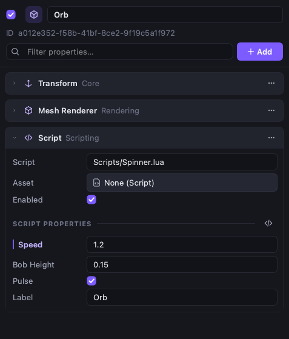

# 32. Компоненты ECS: справочник

> Модуль `gameplay` (таргет `Oxwald::gameplay`, пространство имён `ox::gameplay`, зонтичный заголовок `<oxwald/gameplay/gameplay.hpp>`; компоненты мира — `<oxwald/gameplay/world.hpp>`), а также компоненты рендера из `Oxwald::render` (`ox::render`, заголовки `<oxwald/render/components/*.hpp>`). Здесь перечислены готовые компоненты и системы, которые связывают физику, анимацию, сплайны, звук, ИИ, сеть, скрипты, открытый мир и рендер с миром ECS ([глава 03](03-ecs-scene.md)). Для каждого поля указаны тип, значение по умолчанию и смысл.

## Зачем

Модули движка (физика, анимация, ИИ…) ничего не знают про ECS. Модуль `gameplay` даёт для них компоненты, которые можно сохранять в сцену, редактировать в инспекторе и читать из Lua, и системы, которые каждый кадр переносят данные между компонентами и модулями. Рендер добавляет свои компоненты: пробы отражений, частицы, туман, пост-обработку. В итоге уровень собирается из данных, без C++:

| Задача | Компоненты |
| --- | --- |
| Физика | `RigidBody`, `Collider`, `CharacterController`, `Trigger`, `Joint` |
| Анимация | `Animator`, `SkinnedMesh`, `IK` |
| Пути | `Spline`, `SplineFollower` |
| Звук | `AudioSource`, `AudioListener` |
| ИИ | `NavMeshSurface`, `NavAgent`, `NavObstacle`, `BehaviorTree`, `Perception` |
| Скрипты | `Script` |
| Сеть | `NetworkIdentity`, `NetworkTransform`, `PredictedCharacter` |
| Открытый мир | `Terrain`, `Vegetation`, `Sky`, `TimeOfDay`, `Water`, `Wind`, `Buoyancy`, `StreamingSource`, `WorldStreaming` |
| Рендер | `ReflectionProbe`, `PlanarReflector`, `IrradianceVolume`, `ParticleEmitter`, `WaterSurface`, `FogVolume`, `VolumetricFog`, `CloudLayer`, `PostProcessVolume`, `VegetationPrototypes`, `TerrainRender` |

## Ключевые понятия

| Понятие | Что это |
| --- | --- |
| Имя компонента | Имя в сценах, Lua и инспекторе без суффикса: `RigidBodyComponent` → `"RigidBody"` |
| Рантайм (runtime) | Сервис, который хранит «живые» объекты: `PhysicsRuntime` (тела), `ScriptRuntime` (экземпляры Lua), `WorldRuntime` (ландшафты)… Хэндлы живут в рантайме, а не в компоненте, поэтому клон и сохранение мира не несут устаревших хэндлов |
| Edit / play mode | `SystemContext::playing`. В edit mode ничего не симулируется, но видны коллайдеры, сплайны, ландшафт и небо. В play mode создаются тела и экземпляры скриптов |
| Runtime-поля | Помечены `NoSerialize` (+ `ReadOnly`/`Hidden`): `bodyId`, `velocity`, `currentState`. В сцену не пишутся |
| `SaveGame` | Поле попадает в сохранение игры ([глава 07](07-savegames.md)): `Trigger.fired`, `SplineFollower.distance`, `TimeOfDay.localHours` |
| `Replicated` | Поле реплицируется по сети ([глава 14](14-networking.md)): `AudioSource.volume`, `Script.enabled` |
| Провайдеры | Интерфейсы, через которые компоненты получают ассеты по UUID или имени: меши для коллайдеров, скелеты, деревья поведения, префабы, скрипты, звуки, карты высот. В `Engine` их реализует база ассетов ([глава 31](31-assets.md)) |

## Шаг 1. Подключение систем

В `Engine` модуль `gameplay` включён по умолчанию. Если вы собираете мир сами (тесты, инструменты, свой цикл):

```cpp
#include <oxwald/gameplay/gameplay.hpp>

ox::registerSceneTypes();
ox::registerGameplayTypes();              // рефлексия + ComponentRegistry (идемпотентно), вместе с компонентами мира
ox::Services services;
ox::gameplay::GameplayAssetRegistry providers;   // провайдеры в памяти; в Engine — база ассетов
providers.registerIn(services);           // заполняет только ещё не зарегистрированные интерфейсы
ox::SystemScheduler scheduler;
ox::addGameplaySystems(scheduler, services, config);   // PhysicsWorld, ScriptVM, EventBus, рантаймы, системы
scheduler.attach(world, services);
scheduler.setPlaying(true);               // физика, скрипты, ИИ, followers работают только в play mode
scheduler.tick(world, services, dt);
```

| `GameplayConfig` | По умолчанию | Смысл |
| --- | --- | --- |
| `physics`, `animation`, `splines`, `audio`, `ai`, `networking`, `scripting` | `true` | Включение областей |
| `coroutines` | `true` | Корутины сущностей (нужен сервис `CoroutineScheduler`, [глава 08](08-coroutines.md)) |
| `world` | `true` | Компоненты и системы мира (только в сборке с модулем `world`) |
| `prediction` | `true` | Клиентское предсказание для `PredictedCharacter` |
| `physicsWorld` | — | `physics::PhysicsWorldDesc` создаваемого `PhysicsWorld` ([глава 09](09-physics.md)) |
| `scriptVM` | — | `script::ScriptVMConfig` создаваемой VM ([глава 15](15-scripting-lua.md)) |
| `createEventBus` | `true` | Создать `EventBus`: события рантаймов публикуются и туда |
| `tickCoroutines` | `true` | Тикать `CoroutineScheduler` (выключите, если это делает ваш цикл) |
| `addTransformSystem` | `true` | Добавить `TransformSystem`, если его нет |
| `worldSystems` | — | `WorldSystemsConfig`: `physics`, `vegetation`, `streaming`, `bindLua` (`true`), `aspect` (16/9), `maxVegetationChunksPerFrame` (16), `streamingExecutor` (`Auto`/`Inline`/`JobSystem`/`ThreadPool`) |

Аудио работает, только если зарегистрирован сервис `audio::AudioEngine`; отладочная отрисовка — если есть `DebugDraw`. `Engine` создаёт оба.

Полный пример: `samples/guide_examples/32-gameplay-components/systems_modes.cpp` (`EditModeDoesNotSimulatePlayModeDoes`).

## Шаг 2. Edit и play mode, системы и фазы

```cpp
for (int i = 0; i < 30; ++i) scheduler.tick(world, services, 1.0 / 60.0);
crate.worldPosition().y;      // 5 — edit mode: тел нет, ничего не падает

scheduler.setPlaying(true);   // на первом кадре Gameplay.Lifecycle создаёт тела, потом экземпляры скриптов
for (int i = 0; i < 180; ++i) scheduler.tick(world, services, 1.0 / 60.0);
crate.worldPosition().y;      // ≈ 0.5 — лежит на полу

// Play-in-editor: симулируется клон, редактируемый мир не меняется.
std::unique_ptr<ox::World> playWorld = editWorld.clone();
scheduler.attach(*playWorld, services);
```

Переходы применяются в начале кадра:

- **Вход в play mode.** Создаются тела, персонажи и соединения (до скриптов, чтобы в `onCreate` уже работала физика), затем экземпляры скриптов.
- **Выход из play mode.** Скрипты получают `onDestroy`, корутины сущностей отменяются, звук останавливается, состояние ИИ сбрасывается, тела удаляются.
- **Изменение компонента** (инспектор, `patch`, Lua) ловится сигналами EnTT. Тело пересоздаётся на ближайшем фиксированном шаге (скорости сохраняются). Скрипт пересоздаётся. Аниматор перестраивается, только если сменились ассеты или контроллер: правка параметров не перезапускает state machine.

Системы ищутся по имени (`ox::gameplay::systems::k*`): `scheduler.find(...)`, `scheduler.setEnabled(...)`.

| Фаза | Порядок | Система | Режим | Работа |
| --- | --- | --- | --- | --- |
| PreUpdate | −1000 | `Gameplay.Lifecycle` | всегда | Подключение рантаймов, переходы edit ↔ play |
| PreUpdate | −990 | `Gameplay.World.Lifecycle` | всегда | То же для мира |
| PreUpdate | −950 | `Gameplay.Assets.HotReload` | всегда | Применение hot reload скриптов, деревьев, префабов, аниматоров, мешей коллайдеров |
| PreUpdate | −900 | `Gameplay.Net.Poll` | всегда | Сетевые часы, приём, интерполяция клиента |
| PreUpdate | −500 | `Gameplay.World.Streaming` | play | Стриминг чанков |
| PreUpdate | −400 | `Gameplay.World.Terrain` | всегда | Построение и пересборка ландшафтов |
| PreUpdate | −300 | `Gameplay.World.Environment` | всегда | Время суток, небо, ветер, погода → `Light`, `Environment`, камера |
| PreUpdate | 0 | `Gameplay.Script.PreUpdate` | play | `vm.update` (таймеры, корутины, hot reload), создание экземпляров |
| PreUpdate | 10 | `Gameplay.Coroutines` | всегда | `CoroutineScheduler::tick` |
| FixedUpdate | −100 | `Gameplay.Script.FixedUpdate` | play | `onFixedUpdate` |
| FixedUpdate | −90 | `Gameplay.Net.Predict` | play | Предсказание `PredictedCharacter` |
| FixedUpdate | −70 | `Gameplay.AI.Perception` | play | Зрение, слух, ключи `target*` в blackboard |
| FixedUpdate | −60 | `Gameplay.AI.BehaviorTrees` | play | Тик деревьев поведения |
| FixedUpdate | −50 | `Gameplay.AI.Navigation` | play | Навмеш, толпа, движение агентов |
| FixedUpdate | −10 | `Gameplay.World.Buoyancy` | play | Силы плавучести |
| FixedUpdate | 0 | `Gameplay.Physics.Step` | play | Синхронизация в физику, шаг, позы обратно, события |
| FixedUpdate | 10 | `Gameplay.Coroutines.Fixed` | всегда | `fixedTick` после шага физики |
| Update | 0 | `Gameplay.Script.Update` | play | `onStart`/`onUpdate` |
| Update | 50 | `Gameplay.Spline.Followers` | play | Движение по сплайнам, события |
| Update | 100 | `Gameplay.Animation` | всегда* | Аниматоры, root motion, IK, палитры скиннинга |
| PostUpdate | −1100 | `Gameplay.Physics.Interpolate` | play | Интерполяция поз между шагами (до `Transform`, −1000) |
| PostUpdate | 100 | `Gameplay.Audio` | всегда | Позиции слушателя и источников, автозапуск |
| PostUpdate | 200 | `Gameplay.Net.Send` | всегда | Сервер: спавн, снапшоты |
| PostUpdate | 300 | `Gameplay.World.Vegetation` | всегда | Разброс растительности вокруг наблюдателей |
| Extract | 0 | `Gameplay.DebugDraw` | всегда | Отладочная отрисовка в сервис `DebugDraw` |
| Extract | 50 | `Gameplay.World.Extract` | всегда | `WorldRenderData` для рендера |

\* Аниматоры в edit mode обновляются только с `Animator.animateInEditMode = true`.

Компоненты рендера обрабатывает сам рендерер: его extract-хуки каждый кадр (в edit и play mode) копируют их в снимок кадра `RenderSnapshot` ([глава 18](18-rendering-overview.md)).

Полный пример: `samples/guide_examples/32-gameplay-components/systems_modes.cpp` (`PlayInEditorSimulatesAClone`).

## Шаг 3. Базовые компоненты сцены

Эти компоненты принадлежат модулю `scene` и подробно описаны в [главе 03](03-ecs-scene.md). Многие системы ниже читают или пишут их:

| Компонент | Поля (по умолчанию) | Кто использует |
| --- | --- | --- |
| `Transform` | `position`, `rotation`, `scale` | Все. Физика читает и пишет мировую позу |
| `Camera` | `projection` (`Perspective`), `verticalFov` (60°), `orthographicSize` (5), `nearPlane` (0.1), `farPlane` (1000, ≤ 0 — бесконечность), `aperture` (16), `shutterSpeed` (1/125), `iso` (100), `exposureCompensation` (0), `primary` (`false`) | Рендер. `TimeOfDay` пишет `exposureCompensation` главной камеры. Камера — наблюдатель стриминга |
| `Light` | `type` (`Point`), `color` (1), `intensity` (800: люксы для `Directional`, люмены для остальных), `range` (10 м), `innerConeAngle`/`outerConeAngle` (20°/30°), `areaSize`, `castShadows` (`true`), `shadowResolution` (0 — авто), `shadowBias` (0.0005), `shadowNormalBias` (0.02), `sourceRadius` (0), `volumetric` (`true`), `volumetricIntensity` (1) | Рендер ([глава 20](20-lighting-shadows.md)). `TimeOfDay` управляет солнцем |
| `MeshRenderer` | `mesh`, `materials` (UUID), `castShadows`, `receiveShadows`, `visible` (`true`), `layerMask` (1) | Рендер; `NavMeshSurface.includeMeshes`; коллайдер `Mesh` |
| `Environment` | `skybox`, `skyIntensity` (1), `sun` (`EntityRef`), `ambientIntensity` (1), `fogEnabled` (`false`), `fogColor`, `fogDensity` (0.01), `fogHeightFalloff` (0.2), `fogStartDistance` (0) | Рендер. `TimeOfDay` пишет туман и ambient |
| `Tags` | `tags` | `Trigger.requiredTag`, Lua `hasTag` |
| `Active` | `active` | Неактивные сущности пропускаются системами |

## Шаг 4. Физика (категория Physics)

Тела существуют только в play mode. В edit mode коллайдеры рисуются по данным компонентов. Физика читает мировую трансформацию с учётом иерархии и пишет мировую позу, сохраняя масштаб. Мировой масштаб умножается на `Collider.scale` и запекается в размеры формы; изменение масштаба пересобирает форму. Подробно о физике — в [главе 09](09-physics.md).

```cpp
Entity ground = world.create("Ground");                 // Collider без RigidBody — статическое тело
ground.add<ColliderComponent>().halfExtents = {20.f, 0.5f, 20.f};

Entity crate = world.create("Crate");
auto& rb = crate.add<RigidBodyComponent>();
rb.motionType = physics::MotionType::Dynamic;
rb.mass = 20.f;
crate.add<ColliderComponent>().halfExtents = glm::vec3(0.5f);
```

**`RigidBody`** — тело, которое симулирует физический мир (нужен `Collider`).

| Поле | Тип | По умолчанию | Смысл |
| --- | --- | --- | --- |
| `motionType` | `MotionType` | `Dynamic` | `Static`, `Kinematic` (двигается за `Transform` и толкает динамические тела), `Dynamic` |
| `layer` | string | `""` | Слой коллизий; пусто — по типу движения или сенсору |
| `mass` | f32 | 0 | кг; ≤ 0 — из плотности коллайдера |
| `inertiaOverride` | vec3 | 0 | Диагональ тензора инерции; 0 — из формы |
| `friction`, `restitution` | f32 | 0.5, 0 | Трение, упругость |
| `linearDamping`, `angularDamping` | f32 | 0.05, 0.05 | Затухание |
| `gravityFactor` | f32 | 1 | Множитель гравитации |
| `ccd` | bool | `false` | Непрерывные коллизии для быстрых мелких тел |
| `allowSleeping`, `startActive` | bool | `true`, `true` | Засыпание; активно при создании |
| `lockAxes` | u8 | 0 | Биты `physics::lock`: `TranslationX/Y/Z`, `RotationX/Y/Z` |
| `reportContacts` | bool | `true` | События столкновений |
| `interpolate` | bool | `true` | Плавная поза между фиксированными шагами |
| `initialLinearVelocity`, `initialAngularVelocity` | vec3 | 0 | Начальные скорости |
| `bodyId` | u32 | — | Runtime: хэндл тела (скрыт) |

**`Collider`** — форма тела. Без `RigidBody` сущность становится статическим телом.

| Поле | Тип | По умолчанию | Смысл |
| --- | --- | --- | --- |
| `type` | `ColliderType` | `Box` | `Box`, `Sphere`, `Capsule`, `Cylinder`, `ConvexHull`, `Mesh`, `HeightField`, `Compound` |
| `halfExtents` | vec3 | 0.5 | Полуразмеры коробки |
| `radius`, `halfHeight` | f32 | 0.5, 0.5 | Сфера/капсула/цилиндр (`halfHeight` — половина цилиндрической части) |
| `convexRadius` | f32 | −1 | < 0 — автоматически |
| `density` | f32 | 1000 | кг/м³ (масса, если `RigidBody.mass` = 0) |
| `mesh` | UUID | — | Ассет меша для `Mesh`; для `ConvexHull` без `points` — оболочка вершин меша. Берётся коллизия из импорта, иначе LOD 0 |
| `points` | vec3[] | — | Точки выпуклой оболочки |
| `heights`, `sampleCount`, `heightFieldOffset`, `heightFieldScale` | — | —, 0, 0, 1 | Карта высот (`sampleCount²` отсчётов) |
| `children` | `ColliderChild[]` | — | `Compound`: `{type, halfExtents, radius, halfHeight, points, position, rotation}` |
| `offsetPosition`, `offsetRotation`, `scale` | vec3, quat, vec3 | 0, 1, 1 | Смещение и масштаб формы |
| `isSensor` | bool | `false` | Только события пересечения, без отклика |

`Dynamic` + `Mesh` автоматически заменяется выпуклой оболочкой.

**`CharacterController`** — кинематический персонаж (collide-and-slide). Позиция сущности — это ступни.

| Поле | Тип | По умолчанию | Смысл |
| --- | --- | --- | --- |
| `height`, `radius` | f32 | 1.8, 0.3 | Капсула, м |
| `maxSlopeAngle` | f32 | 45 | Градусы: круче — скольжение |
| `maxStepHeight` | f32 | 0.35 | Ступеньки, м |
| `stickToFloorDistance` | f32 | 0.5 | Прилипание к полу при спуске |
| `mass`, `maxStrength` | f32 | 70, 100 | Масса и сила толчка динамических тел |
| `jumpSpeed`, `airControl` | f32 | 5, 0.25 | Прыжок (м/с), управление в воздухе (0..1) |
| `layer` | string | `""` | Пусто — `Character` |
| `desiredVelocity`, `jump` | vec3, bool | 0, `false` | Runtime-ввод: горизонтальная скорость в мире; прыжок (сбрасывается шагом) |
| `groundState`, `velocity` | — | — | Runtime: `OnGround`, `OnSteepGround`, …, `InAir`; скорость |

```cpp
hero.get<CharacterControllerComponent>().desiredVelocity = {3.f, 0.f, 0.f};   // каждый кадр из ввода
```

**`Trigger`** — делает коллайдер сенсором и фильтрует, кто вызывает события.

| Поле | Тип | По умолчанию | Смысл |
| --- | --- | --- | --- |
| `requiredTag` | string | `""` | Только сущности с этим тегом (`Tags`); пусто — все |
| `reportStay` | bool | `false` | Событие `Stay` на каждом фиксированном шаге |
| `once` | bool | `false` | Выключиться после первого `Enter` |
| `overlapCount` | u32 | — | Runtime: сколько сейчас внутри |
| `fired` | bool | `false` | `SaveGame`: уже срабатывал |

**`Joint`** — соединение тела этой сущности с телом `target` (или с миром). Якоря и оси задаются в локальных координатах сущностей.

| Поле | Тип | По умолчанию | Смысл |
| --- | --- | --- | --- |
| `type` | `ConstraintType` | `Fixed` | `Fixed`, `Point`, `Hinge`, `Slider`, `Distance`, `Cone` |
| `target` | `EntityRef` | пусто | Второе тело; пусто — мир |
| `anchor`, `targetAnchor` | vec3 | 0 | Точки крепления (у `target` — локально, без `target` — в мире) |
| `axis` | vec3 | (0, 1, 0) | Ось петли/ползуна |
| `limitsEnabled`, `limitMin`, `limitMax` | bool, f32 | `false`, −π, π | Пределы (радианы для `Hinge`, метры для `Slider`) |
| `motorMode`, `motorTarget`, `motorMaxForce` | — | `Off`, 0, 1000 | Мотор: `Off`, `Velocity`, `Position` |
| `minDistance`, `maxDistance` | f32 | −1, −1 | `Distance` |
| `springFrequency`, `springDamping` | f32 | 0, 0 | Пружина (0 — жёстко) |
| `coneHalfAngle` | f32 | 30 | `Cone`, градусы |
| `breakForce`, `breakTorque` | f32 | 0, 0 | Порог разрушения; 0 — неразрушимо |
| `broken` | bool | `false` | `SaveGame`: разрушено |

**События и API.** `PhysicsRuntime::onCollision` (`CollisionEvent{phase Begin/Persist/End, a, b, normal, point, impulse}`), `onTrigger` (`TriggerEvent{phase Enter/Stay/Exit, trigger, other}`), `onJointBroken`. События дублируются в `EventBus` и в Lua (`onCollisionEnter`, `onTriggerEnter`…). Методы: `bodyOf`, `entityOf`, `raycast` (возвращает сущность), `overlapSphere`, `addForce`/`addImpulse`/`addTorque`, `linearVelocity`/`setLinearVelocity`, `teleport`, флаг `debugDraw`.

```cpp
ScopedConnection c = services.get<PhysicsRuntime>().onTrigger.connect([&](const TriggerEvent& e) {
    if (e.phase == TriggerPhase::Enter && e.trigger == zone) { /* e.other вошёл */ }
});
```

Полный пример: `samples/guide_examples/32-gameplay-components/systems_modes.cpp` (`CharacterControllerAndTrigger`).

## Шаг 5. Анимация (категория Animation)

Ассеты (скелеты, контроллеры, клипы) приходят через `IAnimationAssetProvider`. Подробно — в [главе 10](10-animation.md).

**`Animator`**

| Поле | Тип | По умолчанию | Смысл |
| --- | --- | --- | --- |
| `skeleton` | UUID | — | Ассет скелета |
| `controller` | UUID | — | Ассет контроллера `.oxanimctrl`; пусто — `inlineController` |
| `inlineController` | `InlineAnimatorController` | — | Однослойная state machine: `parameters[{name, type, defaultValue}]`, `states[{name, clip, speed (1), speedParameter, loop (true)}]`, `transitions[{from ("*" — любое), to, parameter, op, threshold, duration (0.2), hasExitTime, exitTime (1)}]`, `defaultState` |
| `applyRootMotion` | bool | `false` | Двигать сущность (или её `CharacterController`) |
| `playbackSpeed` | f32 | 1 | `Replicated` |
| `animateInEditMode` | bool | `false` | Проигрывать в редакторе |
| `parameters` | map string → f32 | — | `SaveGame`. Значения отправляются в аниматор каждый кадр. Ненулевой триггер срабатывает один раз и сбрасывается в 0 |
| `currentState` | string | — | Runtime |

Типы параметров — `Float`, `Int`, `Bool`, `Trigger`. Условия переходов — `Greater`, `Less`, `Equal`, `NotEqual`, `IsTrue`, `IsFalse`, `Triggered`.

**`SkinnedMesh`** — меш, который рендер рисует с палитрой костей аниматора этой сущности или ближайшего предка.

| Поле | Тип | По умолчанию | Смысл |
| --- | --- | --- | --- |
| `mesh`, `materials` | UUID, UUID[] | — | Меш и материалы по слотам |
| `skinningMethod` | `SkinningMethod` | `Linear` | `Linear` или `DualQuaternion` |
| `gpuSkinning` | bool | `true` | Скиннинг на GPU (compute) |
| `castShadows`, `visible` | bool | `true` | |
| `palette`, `paletteVersion` | — | — | Runtime (не отражены): `model * inverseBind` на кость, версия для рендера |

**`IK`** — `chains[]`, у каждой цепочки `IKChain`:

| Поле | По умолчанию | Смысл |
| --- | --- | --- |
| `type` | `TwoBone` | `TwoBone` (нога, рука) или `Aim` (голова, оружие) |
| `rootJoint`, `midJoint`, `endJoint` | — | Имена костей (для `Aim` — `endJoint`) |
| `target`, `targetOffset` | пусто, 0 | Цель-сущность и смещение в мире (без сущности — само смещение) |
| `pole`, `poleOffset` | пусто, (0, 0, 1) | Направление сгиба колена/локтя |
| `aimAxis` | (0, 0, 1) | Локальная ось кости для `Aim` |
| `weight`, `enabled` | 1, `true` | |

События клипов: `AnimationRuntime::onEvent` (`AnimationEvent{entity, name, payload, weight}`), в Lua — `onAnimationEvent`. Root motion применяется к локальной трансформации или превращается в `CharacterController.desiredVelocity` и поворот сущности.

## Шаг 6. Сплайны (категория Splines)

Подробно — в [главе 11](11-splines.md).

**`Spline`** — кривая в локальных координатах сущности.

| Поле | Тип | По умолчанию | Смысл |
| --- | --- | --- | --- |
| `type` | `SplineType` | `CatmullRom` | `Linear`, `Bezier`, `CatmullRom`, `BSpline`, `Nurbs` |
| `closed` | bool | `false` | Замкнутая |
| `points` | `SplinePoint[]` | — | `{position, inHandle, outHandle, handleMode (Auto), roll (рад), weight (1), up?}` |
| `catmullRomAlpha` | f32 | 0.5 | 0 — uniform, 0.5 — centripetal, 1 — chordal |
| `degree` | u32 | 3 | Степень NURBS |
| `frameMode`, `upVector` | — | `RotationMinimizing`, (0, 1, 0) | Ориентация рамки вдоль кривой |
| `markers` | `{name, t}[]` | — | Именованные точки (события followers) |
| `drawInEditor`, `drawInGame`, `color` | bool, bool, vec4 | `true`, `false`, белый | Отладочная отрисовка |

**`SplineFollower`** — движение сущности по сплайну с постоянной скоростью (play mode).

| Поле | Тип | По умолчанию | Смысл |
| --- | --- | --- | --- |
| `spline` | `EntityRef` | — | Сущность со `Spline` |
| `speed` | f32 | 1 | Единиц в секунду; < 0 — назад. `Replicated`, `SaveGame` |
| `loopMode` | `LoopMode` | `Loop` | `Once`, `Loop`, `PingPong` |
| `orientToPath`, `faceTravelDirection` | bool | `true`, `true` | Поворачивать по пути; при движении назад смотреть по ходу |
| `forwardAxis`, `upAxis` | vec3 | (0, 0, −1), (0, 1, 0) | Оси модели |
| `offset` | vec3 | 0 | Смещение в рамке пути (x вправо, y вверх, z назад) |
| `playing` | bool | `true` | `Replicated`, `SaveGame` |
| `fireMarkers`, `events` | bool, `{name, distance}[]` | `true`, — | События на маркерах и дистанциях |
| `startDistance` | f32 | 0 | Начальная дистанция |
| `distance`, `direction`, `finished` | — | — | `SaveGame`: состояние |

События: `SplineRuntime::onEvent`, в Lua — `onSplineEvent(self, name, distance)`. Запросы: `positionAtDistance`, `rotationAtDistance`, `closestDistance`, `length`.

## Шаг 7. Звук (категория Audio)

Подробно — в [главе 12](12-audio.md).

**`AudioSource`**

| Поле | Тип | По умолчанию | Смысл |
| --- | --- | --- | --- |
| `clip` | UUID | — | Ассет звука (`IAudioClipProvider`) |
| `clipPath`, `stream` | string, bool | `""`, `false` | Путь, если `clip` пуст; стриминг с диска |
| `bus` | string | `"SFX"` | Шина микшера |
| `volume`, `pitch` | f32 | 1, 1 | `Replicated` |
| `loop`, `playOnStart` | bool | `false`, `true` | |
| `spatial` | bool | `true` | 3D-звук от позиции сущности |
| `attenuation` | `AttenuationModel` | `Inverse` | `None`, `Inverse`, `Linear`, `Exponential`, `Custom` |
| `minDistance`, `maxDistance`, `rolloff` | f32 | 1, 100, 1 | Затухание с расстоянием |
| `coneInnerAngle`, `coneOuterAngle`, `coneOuterGain` | f32 | 360, 360, 1 | Направленный источник |
| `dopplerFactor` | f32 | 1 | Доплер (скорость — разностью позиций) |
| `distanceLowPass` | bool | `false` | Глухой звук вдали |
| `occlusion` | bool | `false` | Окклюзия лучами физики: `1 − (1 − 0.6)^попаданий` |
| `priority`, `fadeInSeconds` | i32, f32 | 0, 0 | |
| `playing` | bool | — | Runtime |

**`AudioListener`** — `active` (`true`): слушает первый активный, обычно на камере.

## Шаг 8. ИИ (категория AI)

Подробно — в [главе 13](13-ai.md).

**`NavMeshSurface`** — настройки построения навмеша и его источники. Используется первая поверхность в мире. Запечённые данные хранятся в сцене.

| Поле | По умолчанию | Смысл |
| --- | --- | --- |
| `cellSize`, `cellHeight` | 0.3, 0.2 | Воксели Recast, м |
| `agentHeight`, `agentRadius`, `agentMaxClimb`, `agentMaxSlope` | 2.0, 0.5, 0.9, 45 | Агент (м, градусы) |
| `regionMinSize`, `regionMergeSize` | 8, 20 | Регионы |
| `edgeMaxLen`, `edgeMaxError`, `vertsPerPoly` | 12, 1.3, 6 | Полигоны |
| `detailSampleDist`, `detailSampleMaxError` | 6, 1 | Детальный меш |
| `tiled`, `tileSize` | `false`, 48 | Тайловый навмеш |
| `includeStaticColliders`, `includeMeshes`, `onlyChildren` | `true`, `true`, `false` | Источники: статические коллайдеры, `MeshRenderer` статических сущностей, только поддерево |
| `bakeOnStart` | `true` | Запечь при старте play mode, если данных нет |
| `dynamicObstacles` | `false` | Tile cache для вырезания `NavObstacle` (не сериализуется) |
| `drawInEditor` | `true` | |
| `bakedData` | — | Скрыто: `NavMesh::serialize()`; `AIRuntime::bake(surface)` работает и в edit mode |

**`NavAgent`**

| Поле | По умолчанию | Смысл |
| --- | --- | --- |
| `radius`, `height` | 0.5, 2 | |
| `maxSpeed`, `maxAcceleration` | 3.5, 8 | м/с, м/с² |
| `separationWeight`, `avoidanceQuality` | 2, 3 | Расталкивание в толпе, качество обхода (0..3) |
| `stoppingDistance` | 0.3 | Дистанция остановки, м |
| `updatePosition`, `updateRotation`, `driveCharacterController` | `true` | Двигать сущность или её `CharacterController` |
| `destination`, `hasDestination` | — | `SaveGame` |
| `reached`, `velocity` | — | Runtime |

**`NavObstacle`** — `shape` (`Cylinder`/`Box`), `radius` (0.5), `height` (2), `halfExtents` ((0.5, 1, 0.5)), `moveThreshold` (0.2 м, после такого сдвига дыра вырезается заново). Работает только при `dynamicObstacles`.

**`BehaviorTree`**

| Поле | По умолчанию | Смысл |
| --- | --- | --- |
| `tree` | — | Ассет `.oxbt` (`IBehaviorTreeProvider`) |
| `treeJson` | `""` | Дерево в JSON прямо в компоненте (формат `BTFactory`) |
| `blackboard` | — | Начальные значения: `{key, type (Bool/Int/Float/String/Vec3/Entity), boolValue, intValue, floatValue, stringValue, vec3Value, entityValue}` |
| `enabled` | `true` | `SaveGame` |
| `tickInterval` | 0 | Секунды; 0 — каждый фиксированный шаг |
| `restartOnFinish` | `true` | |
| `status` | — | Runtime |

Узлы геймплея: `MoveTo`, `PlayAnimation`, `PlaySound`, `IsTargetVisible`, `ScriptAction`, а также встроенные (`Wait`, `SetBlackboard`…). В blackboard есть `self`, а восприятие пишет `target`, `targetPosition`, `targetVisible`.

**`Perception`**

| Поле | По умолчанию | Смысл |
| --- | --- | --- |
| `team` | 1 | Команда. `Replicated` |
| `listener`, `source`, `visible` | `true` | Воспринимает сам; заметен другим; виден (`visible` — `Replicated`) |
| `sight` | — | `SightConfig`: `range` 20, `fovDegrees` 90, `peripheralFovDegrees` 160, `peripheralRange` 6, `loseSightRange` 25, `eyeHeight` 1.7, `targetHeight` 1, `forgetAfter` 8 |
| `hearing` | — | `HearingConfig`: `rangeMultiplier` 1, `threshold` 0.05, `useOcclusion` `true`, `occludedFactor` 0.4, `forgetAfter` 5 |
| `detectHostile`, `detectNeutral`, `detectFriendly` | `true`, `false`, `false` | Кого замечать |
| `target`, `targetVisible` | — | Runtime: лучшая враждебная цель |

События: `AIRuntime::onPerception`, в Lua — `onTargetSensed`/`onTargetLost(self, source, "sight"|"hearing")`.

## Шаг 9. Скрипты (категория Scripting)

**`Script`** — Lua-скрипт на сущности. Экземпляры существуют только в play mode. Подробно о VM — в [главе 15](15-scripting-lua.md).

| Поле | Тип | По умолчанию | Смысл |
| --- | --- | --- | --- |
| `script` | string | `""` | Путь Lua (относительно корней поиска VM) или имя у `IScriptSourceProvider`: `"Scripts/pickup.lua"`, `"Scripts/pickup"`, `"pickup"` |
| `asset` | UUID | — | Ассет скрипта; если задан, важнее `script` |
| `properties` | map string → `ScriptPropertyValue` | — | Переопределения объявленных свойств: `{type, number, boolean, text, vector}`. Применяются при создании и при изменении, приводятся к типу и диапазону |
| `enabled` | bool | `true` | `Replicated`, `SaveGame` |

```cpp
auto& script = pickup.add<ScriptComponent>();
script.script = "pickup";
script.properties["spinSpeed"] = ScriptPropertyValue::makeNumber(180.0);   // как в инспекторе
script.properties["score"] = ScriptPropertyValue{script::ScriptPropertyType::Int, 25.0};

sol::table self = services.get<ScriptRuntime>().self(pickup);   // self экземпляра из C++
services.get<ScriptRuntime>().sendEvent(pickup, "reset");       // -> onEvent(self, "reset", nil)
```



## Шаг 10. Сеть (категория Networking)

Подробно — в [главе 14](14-networking.md).

**`NetworkIdentity`** — сервер реплицирует сущность клиентам.

| Поле | По умолчанию | Смысл |
| --- | --- | --- |
| `netType` | `""` | Имя префаба, который спавнит клиент (`IPrefabProvider`); иначе пустая сущность |
| `relevancy`, `relevancyRadius` | `Always`, 100 | `Always`, `Distance`, `OwnerOnly`, `Custom` |
| `priority` | 1 | Приоритет в снапшоте |
| `viewer` | `false` | Позиция наблюдателя владельца для `Distance` |
| `netId`, `owner` | — | Runtime; `owner` задаёт сервер до репликации |

**`NetworkTransform`**

| Поле | По умолчанию | Смысл |
| --- | --- | --- |
| `syncPosition`, `syncRotation`, `syncScale` | `true`, `true`, `false` | Что реплицировать |
| `positionRange`, `positionResolution` | 4096, 0.01 | ±метров и шаг квантования |
| `rotationBits` | 10 | Бит на компоненту поворота |
| `interpolate` | `true` | Интерполяция на клиенте |
| `predicted`, `correctionThreshold` | `false`, 0.5 | Владелец симулирует сам; сервер поправляет при расхождении больше порога (м) |

**`PredictedCharacter`** — персонаж с предсказанием на клиенте и переигрыванием ввода (нужны `CharacterController`, `NetworkIdentity` с `owner` и `NetworkTransform.predicted`).

| Поле | По умолчанию | Смысл |
| --- | --- | --- |
| `moveAction`, `jumpAction` | `"Move"`, `"Jump"` | Действия ввода ([глава 06](06-input.md)): Axis2D и Bool |
| `moveSpeed` | 5 | м/с при полном отклонении |
| `correctionTolerance` | 0.05 | м расхождения до переигрывания |
| `inputRedundancy` | 10 | Сколько неподтверждённых вводов повторять в пакете |
| `corrections`, `pendingInputs` | — | Runtime (клиент) |

Реплицируются мировая трансформация и все отражённые поля с атрибутом `Replicated` у компонентов сущности.

## Шаг 11. Открытый мир (категория World)

Компоненты хранят только настройки. Производные данные (карты высот, квадродеревья, чанки растительности, тела, часы) живут в сервисе `WorldRuntime`. Визуальная часть (ландшафт, LOD, небо) работает и в edit mode. Алгоритмы описаны в [главе 16](16-world.md), отрисовка — в [главе 28](28-world-rendering.md).

```cpp
Entity terrain = world.create("Terrain");
auto& t = terrain.add<TerrainComponent>();
t.resolution = 129; t.worldSize = 128.f; t.heightScale = 8.f;

Entity env = world.create("Environment");
env.add<EnvironmentComponent>().sun = sun.ref();
env.add<TimeOfDayComponent>().localHours = 13.5;
// ...attach, tick
services.get<WorldRuntime>().terrainHeight({3.f, 4.f});   // std::optional<f32>
env.patch<TimeOfDayComponent>([](TimeOfDayComponent& c) { c.localHours = 1.0; });   // ночь, без play mode
```

**`Terrain`** — ландшафт на карте высот. Высота = `Y сущности + heightOffset + normalized · heightScale`. Сетка покрывает `worldSize` по X и Z и центрирована на сущности (или начинается в `XZ + offset`). Поворот и масштаб сущности игнорируются. Любое изменение компонента или перемещение сущности пересобирает ландшафт.

| Поле | По умолчанию | Смысл |
| --- | --- | --- |
| `source` | `Procedural` | `Procedural` (шум + эрозия), `Heightmap` (ассет), `Flat`, `External` (тайлы стриминга) |
| `heightmap` | — | Ассет карты высот (`IHeightmapProvider`) |
| `noise` | — | `TerrainNoiseSettings` ([глава 16](16-world.md)) |
| `hydraulicErosion`, `hydraulic`, `thermalErosion`, `thermal` | `false`, —, `false`, — | Эрозия |
| `resolution`, `worldSize` | 257, 512 | Отсчётов на сторону; метров |
| `heightScale`, `heightOffset` | 64, 0 | Высоты |
| `format` | `Float32` | `Float32` или `UNorm16` |
| `centered`, `offset` | `true`, 0 | Размещение |
| `layers`, `splatRules`, `splatResolution` | —, —, 0 | Материалы слоёв (≤ 8), правила автораскраски, разрешение splat map (0 — как у высот) |
| `lod` | `{leafNodeSize 32, lodCount 4, viewDistance 2000}` | CDLOD |
| `collision`, `physicsTileQuads`, `friction`, `restitution` | `true`, 64, 0.6, 0 | Статические тела-тайлы в play mode |
| `builtResolution`, `minHeight`, `maxHeight` | — | Runtime |

**`Vegetation`** — растительность, которая разбрасывается по ландшафту вокруг наблюдателей.

| Поле | По умолчанию | Смысл |
| --- | --- | --- |
| `layers` | — | `world::VegetationLayer` ([глава 16](16-world.md)) |
| `terrain` | пусто | Ландшафт; пусто — на этой же сущности |
| `chunkSize`, `cellSize`, `patternPeriod` | 64, 32, 64 | Чанки, ячейки каллинга, период узора |
| `scatterRadius` | 256 | Радиус вокруг наблюдателя (выгрузка дальше 1.25×) |
| `colliders` | `true` | Тела стволов в play mode |
| `exclusions` | — | Зоны исключения |
| `chunkCount`, `instanceCount` | — | Runtime |

**`Sky`** — `turbidity` (2.5), `sunDirection` ((0.3, 0.8, −0.5), если нет `TimeOfDay`), `skyIntensity` (1), `sunDisc` (`true`), `sunDiscIntensity` (1), `sunAngularDiameterDeg` (0.53), `moon` (`true`), `moonIntensity` (1), `moonAngularDiameterDeg` (0.52), `stars` (`true`), `starsIntensity` (1).

**`TimeOfDay`** — смена дня и ночи. Время идёт в play mode. В edit mode состояние вычисляется из полей.

| Поле | По умолчанию | Смысл |
| --- | --- | --- |
| `latitudeDeg`, `longitudeDeg` | 52.37, 4.90 | Место (Амстердам) |
| `year`, `month`, `day` | 2024, 6, 21 | Дата |
| `localHours` | 9.0 | Местное время. `SaveGame`; записывается обратно при ходе времени |
| `utcOffsetHours` | 2.0 | Местное = UTC + смещение |
| `timeScale` | 60 | Игровых секунд за реальную (сутки за 24 минуты) |
| `paused` | `false` | `SaveGame` |
| `turbidity` | 2.5 | Мутность воздуха |
| `sun` | пусто | Направленный `Light`; пусто — `Environment.sun` этой сущности, иначе первый направленный свет |
| `driveLight`, `illuminanceScale` | `true`, 1 | Свет: интенсивность = люксы × масштаб |
| `driveEnvironment`, `driveExposure` | `true`, `true` | Туман и ambient `Environment`; `exposureCompensation` главной камеры |
| `curveDriver`, `curveInterp` | `SunElevation`, `Smooth` | Кривые атмосферы по высоте солнца или по часу |
| `fogDensityCurve`, `ambientIntensityCurve`, `exposureCurve`, `starsCurve`, `ambientColorGradient`, `fogColorGradient` | — | Свои кривые (пусто — по умолчанию) |
| `sunElevationDeg`, `isDay`, `moonIllumination` | — | Runtime |

События `Sunrise`/`Sunset`/`Noon`/`Midnight`: `WorldRuntime::onTimeOfDayEvent` и `EventBus` (`WorldTimeEvent`).

**`Water`** — поверхность из волн Герстнера для физики. Уровень = Y сущности, прямоугольник `size` центрирован на сущности (≤ 0 — бесконечный). Для отрисовки добавьте `WaterSurface` (шаг 12).

| Поле | По умолчанию | Смысл |
| --- | --- | --- |
| `waves` | — | Явные волны; если пусто — `GerstnerWaves::fromWind` |
| `windDirection`, `windSpeed`, `waveCount`, `seed`, `steepness` | (1, 0), 6, 6, 1, 0.5 | Генерация из ветра (`waveCount = 0` — ровная вода) |
| `size` | (200, 200) | Размер, м |
| `fluidDensity` | 1000 | кг/м³ |
| `current` | 0 | Течение, м/с |

**`Wind`** — глобальный ветер (первый активный) и погода.

| Поле | По умолчанию | Смысл |
| --- | --- | --- |
| `active` | `true` | |
| `direction`, `speed` | (1, 0), 4 | Куда дует (XZ), м/с |
| `gustStrength`, `gustWavelength` | 0.4, 60 | Порывы |
| `turbulence`, `turbulenceFrequency` | 0.15, 0.6 | Турбулентность |
| `weatherEnabled`, `weather` | `false`, `clear` | Погода: `{cloudCover, rain, snow, fogDensityBoost, windSpeed, gustStrength}`. `weather` — `SaveGame` |
| `transitionSeconds`, `temperatureCelsius` | 10, 15 | Плавный переход; температура (снег копится ниже 0 °C) |
| `weatherState` | — | Runtime: текущая погода, влажность, снежный покров |

**`Buoyancy`** — плавучесть тела (нужны динамический `RigidBody` и `Collider`).

| Поле | По умолчанию | Смысл |
| --- | --- | --- |
| `halfExtents`, `subdivisions` | 0.5, 3 | Коробка с `subdivisions³` точками (если `points` пуст) |
| `points` | — | Явные точки `{localPosition, volume, height}` относительно центра масс |
| `fluidDensity` | 0 | 0 — из `Water` под телом |
| `linearDrag`, `angularDrag` | 1, 0.5 | Сопротивление воды |
| `submergedFraction` | — | Runtime: доля под водой |

**`StreamingSource`** — наблюдатель стриминга: `enabled` (`true`), `radiusScale` (1; меньше — для второстепенных наблюдателей).

**`WorldStreaming`** — стриминг чанков (play mode). Каждый чанк спавнит дочерние сущности, при выгрузке они удаляются.

| Поле | По умолчанию | Смысл |
| --- | --- | --- |
| `enabled` | `true` | |
| `settings` | — | `ChunkStreamerSettings`: размер чанка, радиусы, бюджеты ([глава 16](16-world.md)) |
| `chunkPath` | `""` | Файл `ChunkData`, `{x}`/`{z}` заменяются: `"project://World/chunk_{x}_{z}.oxchunk"` |
| `prefabPattern` | `""` | Префаб чанка: `"Chunks/chunk_{x}_{z}"` |
| `useCameraAsViewer` | `true` | Главная камера — тоже наблюдатель |
| `tileLod`, `tileCollision`, `tilePhysicsQuads`, `tileLayers` | `{16, 3, 1000}`, `true`, 64, — | Шаблон тайлов ландшафта |
| `vegetationLayers` | — | Прототипы растительности чанков |
| `loadedChunks` | — | Runtime |

**API мира.** `WorldRuntime`: `terrainHeight`, `terrainNormal`, `terrainAt`, `applyBrush`/`paintSplat` (правки только в рантайме), `waterHeight`, `submergedFraction`, `windAt`, `weather`, `setWeather`, `timeOfDay`, `setTimeOfDay`, `skyState`, `isAreaReady`.

Полный пример: `samples/guide_examples/32-gameplay-components/world_components.cpp` (`TerrainAndTimeOfDayInEditMode`, `WaterWindAndBuoyancyInPlayMode`: ящик 400 кг/м³ погружён на 40 %).

## Шаг 12. Компоненты рендера

Компоненты регистрирует `ox::render::registerRenderTypes()` (это делают `Engine`, редактор и `Renderer::create()`). Положение и поворот берутся из мировой трансформации сущности. Ниже — краткий справочник; подробности и cvar'ы — в главах рендеринга.

```cpp
#include <oxwald/render/components/reflections.hpp>

auto& probe = room.add<ox::render::ReflectionProbeComponent>();
probe.extents = {4.f, 1.5f, 6.f};      // коробка комнаты: параллакс-коррекция
probe.update = ox::render::ReflectionProbeUpdate::OnEnable;
```

**Отражения и GI** ([глава 21](21-reflections-gi.md)):

| Компонент | Поля (по умолчанию) |
| --- | --- |
| `ReflectionProbe` | `enabled` (`true`), `extents` ((5, 3, 5) — полуразмер коробки влияния), `blendDistance` (1 м), `boxProjection` (`true`), `captureOffset` (0), `resolution` (128, ограничено `r.ReflectionProbes.Resolution`), `update` (`Baked`/`OnEnable`/`Realtime`, по умолчанию `Baked`), `priority` (0), `intensity` (1), `nearPlane` (0.05), `farPlane` (200) |
| `PlanarReflector` | `enabled`, `size` (0 — бесконечная плоскость; полуразмер в локальной XZ), `resolutionScale` (1), `clipOffset` (0.02), `maxDistance` (500), `maxRoughness` (0.3), `distortion` (0.02), `intensity` (1), `priority` (0). Плоскость — локальная XZ, нормаль +Y |
| `IrradianceVolume` | `enabled`, `extents` ((10, 4, 10)), `probeCount` ((8, 4, 8), ≥ 2 и ≤ 64 по оси, ≤ 16384 всего), `blendDistance` (1), `intensity` (1), `normalBias` (0.25), `viewBias` (0.15), `captureResolution` (32), `priority` (0) |

**Частицы и вода** ([глава 23](23-transparency-water-particles.md)). `ParticleEmitter` — GPU-частицы: форма спавна задаётся в локальных координатах (ось эмиссии +Y), симуляция идёт в мировых:

| Группа | Поля (по умолчанию) |
| --- | --- |
| Общее | `enabled` (`true`), `maxParticles` (1024, ограничено `r.Particles.Budget`), `seed` (1) |
| Спавн | `spawnRate` (50/с), `bursts[{time, count 10, cycles 1 (0 — бесконечно), interval 1}]`, `loop` (`true`), `duration` (5 с), `lifetime` ((1.5, 2.5) с) |
| Форма | `shape` (`Point`/`Sphere`/`Cone`/`Box`/`MeshSurface`), `radius` (0.5), `coneAngle` (25°), `boxExtents` (0.5), `shapeMesh`, `emitFromShell` (`false`) |
| Движение | `speed` ((1, 2)), `velocity` (0), `gravity` ((0, −9.81, 0)), `gravityScale` (0), `drag` (0), `turbulence` (0), `turbulenceFrequency` (1), `turbulenceSpeed` (0.5) |
| Вид | `size` ((0.1, 0.2) м), `sizeOverLife[{time, value}]`, `color` (1), `colorOverLife[{time, color}]`, `emissive` (1), `rotation` ((0, 360)°), `rotationSpeed` (0), `texture`, `sprite` (`SoftCircle`/`Smoke`/`Spark`), `atlasColumns`/`atlasRows` (1), `flipbookFps` (0), `randomStartFrame` (`false`) |
| Отрисовка | `blend` (`Additive`/`Alpha`/`Premultiplied`, по умолчанию `Alpha`), `renderMode` (`Billboard`/`StretchedBillboard`/`Mesh`), `stretch` (0.05), `mesh`, `lit` (`false`), `softDistance` (0.3 м), `sort` (`false`) |
| Коллизии | `collision` (`None`/`Bounce`/`Kill`), `bounce` (0.4), `friction` (0.2) — по буферу глубины |

`WaterSurface` — отрисовка воды: `visible` (`true`), `waves[{direction, wavelength 10, amplitude 0.2, steepness 0.5, phase, speedScale 1}]` (пусто — лёгкая зыбь), `size` ((200, 200)), оптика `absorption` ((0.45, 0.09, 0.06) 1/м), `scatterColor`, `refractionStrength` (0.05), `roughness` (0.04), детальные нормали `normalMap`, `detailNormalStrength` (0.35), `detailScale` (0.12), `detailSpeed` (0.04), пена `shoreFoamDistance` (0.35), `crestFoam` (0.5), `foamIntensity` (1), каустики `causticsIntensity` (1), `causticsScale` (0.3), `causticsFalloff` (0.25), под водой `underwaterColor`, `underwaterDensity` (0.06). Чтобы плавучесть совпадала с картинкой, задайте те же волны в `Water`.

**Волюметрика** ([глава 22](22-volumetrics.md)). Глобальный высотный туман задаётся в `Environment` (`fog*`).

| Компонент | Поля (по умолчанию) |
| --- | --- |
| `FogVolume` | `shape` (`Box`/`Sphere`/`Ellipsoid`), `extents` (2; для сферы — `x`), `density` (0.1 1/м), `albedo` (1), `emission` (0), `falloff` (0.25), `anisotropy` (0), `noiseIntensity` (0), `noiseScale` (6 м), `noiseVelocity` (0), `windInfluence` (1) |
| `VolumetricFog` | Глобальные настройки froxel-тумана (первый активный): `anisotropy` (0.6), `ambientIntensity` (1), `directionalIntensity` (1), `localLightIntensity` (1), `emission` (0), `distance` (0 — `r.VolumetricFog.Distance`) |
| `CloudLayer` | `altitude` (1500 м), `thickness` (1800), `coverage` (0.45), `cloudType` (0.5: 0 — слоистые, 1 — кучево-дождевые), `density` (1), `albedo` (1), `windDirection` ((1, 0)), `windSpeed` (8), `weatherScale` (24000), `shapeScale` (4500), `detailScale` (600), `detailStrength` (0.35), `ambientIntensity` (1), `sunIntensity` (1), `forwardScattering` (0.75), `shadowStrength` (0.8), `weatherOffset` (0) |

**Пост-обработка** ([глава 25](25-upscalers-postprocess.md)). `PostProcessVolume`: `enabled` (`true`), `unbound` (`true` — действует везде, иначе коробка), `extents` (5), `blendRadius` (1 м), `blendWeight` (1), `priority` (0; больше — применяется позже и побеждает), `settings`. В `settings` (`PostProcessSettings`) каждая группа включается своим флагом `override*`:

| Группа | Флаг | Поля (по умолчанию) |
| --- | --- | --- |
| Экспозиция | `overrideExposure` | `autoExposure` (`false`), `exposureCompensation` (0 EV), `minEV100`/`maxEV100` (−4/20), `adaptationSpeedUp`/`Down` (3/1 EV/с), `histogramLowPercent`/`HighPercent` (70/95) |
| Bloom | `overrideBloom` | `bloomIntensity` (0.04), `bloomDirtTexture`, `bloomDirtIntensity` (0) |
| Глубина резкости | `overrideDepthOfField` | `focusDistance` (0 — выкл.), `aperture` (0 — из камеры), `focalLength` (0 — из FOV), `maxBokehSize` (1.5 %) |
| Motion blur | `overrideMotionBlur` | `motionBlurAmount` (0.5), `motionBlurMax` (5 %) |
| Баланс белого | `overrideWhiteBalance` | `temperature` (6500 K), `tint` (0) |
| Грейдинг | `overrideGrading` | `saturation` (1), `contrast` (1), `lift` (0), `gamma` (1), `gain` (1) |
| LUT | `overrideLut` | `lutTexture`, `lutIntensity` (1) |
| Линза и плёнка | `overrideLens` | `vignetteIntensity`, `chromaticAberration`, `filmGrainIntensity`, `sharpen` (все 0) |

**Мир** ([глава 28](28-world-rendering.md)):

| Компонент | Поля (по умолчанию) |
| --- | --- |
| `VegetationPrototypes` | `prototypes[]`: `{prototype (индекс VegetationLayer::prototype), name, lods (меши LOD 0..2; пусто — встроенный меш), material, impostor (true), windSway (1), windFlutter (1), translucency (0.6), castShadows (true)}`. Компоненты всех сущностей объединяются |
| `TerrainRender` | На сущности с `Terrain`: `triplanarSlopeDeg` (35), `heightBlend` (0.2), `macroVariation` (0.35), `tilingBreakup` (0.5), `layerTileMeters` (4), `castShadows` (`true`), `tessellationHeight` (0.08 м) |

Полный пример: `samples/guide_examples/32-gameplay-components/render_components.cpp` (регистрация, значения по умолчанию, сохранение в `.oxscene.json` и загрузка).

## Шаг 13. Lua API сущностей

Каждый экземпляр скрипта получает свою сущность в `self.entity`. Ошибки API (неверная сущность, неизвестное поле, неверный тип) — обычные ошибки Lua: они пишутся в лог с трассировкой и ловятся через `pcall`.

Бонус, который крутится и при касании игрока начисляет очки (`scripts/pickup.lua`):

```lua
properties = {
    spinSpeed = { type = "float", default = 90, min = 0, max = 720, tooltip = "Градусов в секунду" },
    score     = { type = "int", default = 10, min = 0, max = 1000 },
}

function onStart(self)
    local e = self.entity
    e.transform.position = vec3(0, 1, 0)              -- локальная позиция
    local col = e:get("Collider")                     -- прокси отражённого компонента
    col.type = "Sphere"                               -- enum по имени
    col.radius = 0.5
    e:add("Trigger", { requiredTag = "player" })      -- коллайдер становится сенсором
    self.spun = 0
end

function onUpdate(self, dt)
    local angle = math.rad(self.spinSpeed) * dt
    self.entity.transform:rotate(vec3(0, 1, 0), angle)
    self.spun = self.spun + angle
end

function onTriggerEnter(self, other)
    other:sendEvent("pickup", { score = self.score }) -- -> onEvent(self, name, payload) скрипта игрока
    scene.destroy(self.entity)
end
```

Игрок (`scripts/player.lua`):

```lua
function onCreate(self)
    self.score = 0
    local rb = self.entity:get("RigidBody")
    self.massAtStart = rb.mass
    rb.mass = 80                                      -- запись поля: тело пересоздастся на ближайшем шаге
    self.motion = rb.motionType                       -- "Dynamic"
end

function onEvent(self, name, payload)
    if name == "pickup" then
        self.score = self.score + payload.score
        self.lastPickupY = self.entity.transform.worldPosition.y
    end
end
```

**Сущность** (`self.entity`, результаты `scene.find`, аргументы колбэков):

| Член | Смысл |
| --- | --- |
| `e.name`, `e.id`, `e.active`, `e.parent` | Имя, UUID (строка), активность, родитель |
| `e.transform` | `position`, `rotation`, `scale` (локальные), `worldPosition`, `worldRotation`; `forward`, `right`, `up` (мировые оси, вперёд = −Z); `:translate(v[, "local"])`, `:rotate(axis, angle)` / `:rotate(quat)`, `:lookAt(entity или vec3[, up])` |
| `e:get(name)` | Прокси компонента или `nil`. Поля читаются и пишутся по именам, enum'ы — строками. Векторы — значения: присваивайте вектор целиком. Вложенные структуры и массивы (с 1) — тоже прокси. Есть `:_get(path)`, `:_set(path, v)`, `:_fields()`, `:_value()`, `:_type()` |
| `e:add(name[, table])`, `e:has(name)`, `e:remove(name)` | Компоненты. Поля `EntityRef` принимают сущности |
| `e.body` | `addForce`, `addImpulse(v[, point])`, `addTorque`, `teleport(p[, q])`, `linearVelocity`, `angularVelocity` |
| `e.agent` | `moveTo(p)`, `stop()`, `reached()`, `velocity`, `destination` |
| `e.animator` | `setFloat`, `setBool`, `setTrigger`, `play(state[, fade])`, `currentState` |
| `e.spline` | `length()`, `positionAt(d)`, `rotationAt(d)`, `closestDistance(p)` |
| `e:sendEvent(name, payload)`, `e:script()` | Событие скрипту сущности; его `self` |
| `e:children()`, `e:findChild(name)`, `e:setParent(other или nil)`, `e:hasTag(tag)` | Иерархия и теги |

**Колбэки скрипта:** `onCreate`, `onStart`, `onUpdate(dt)`, `onFixedUpdate(dt)`, `onDestroy` (сущность и компоненты ещё живы), `onEvent(name, payload)`, `onTriggerEnter/Stay/Exit(other)`, `onCollisionEnter/Stay/Exit(other, info)` (`info.normal`, `info.point`, `info.impulse`), `onSplineEvent(name, distance)`, `onAnimationEvent(name, payload)`, `onTargetSensed/onTargetLost(source, sense)`.

**Глобальные таблицы:**

| Таблица | Функции |
| --- | --- |
| `scene` | `find(nameOrUuid)`, `findAll(componentName)`, `create([name[, parent]])`, `spawn(prefab[, pos[, rot]])`, `destroy(entity)`; async: `nextFrame()`, `delay(seconds)` |
| `physics` | `raycast(origin, dir[, maxDist[, ignore]])` → `{entity, point, normal, distance}` или `nil`, `overlapSphere(c, r)`, `gravity()`, `setGravity(v)`; async: `raycastAsync(...)` |
| `audio` | `play(clipPath[, position[, volume]])`, `stop(id[, fade])`, `isPlaying(id)`, `playSource(entity)`, `stopSource(entity[, fade])` |
| `ai` | `findPath(a, b)`, `moveTo(entity, pos)`, `reportNoise(pos[, loudness[, radius[, instigator[, tag]]]])`, `blackboardSet(entity, key, value)`; async: `moveToAsync(entity, pos)` |
| `world` | `terrainHeight(x, z)`, `terrainNormal(x, z)`, `waterHeight(x, z)` (вне ландшафта/воды — `nil`), `timeOfDay()`, `setTimeOfDay(h)`, `isDay()`, `sunDirection()`, `wind(pos)`, `setWeather(name[, seconds])` (`clear`, `overcast`, `rainy`, `storm`, `snowy`), `isAreaReady(pos, r)`, `time()` |

Асинхронные функции возвращают `Future` и ждутся через `await` внутри `spawn(function() ... end)` ([глава 08](08-coroutines.md)):

```lua
spawn(function()
    local hit = await(physics.raycastAsync(self.entity.transform.worldPosition, vec3(0, -1, 0), 10))
    await(scene.delay(0.5))
end)
```

Полный пример: `samples/guide_examples/32-gameplay-components/lua_entity_api.cpp` (`PickupScoresAndDestroysItself`, `InlineScriptSceneAndPhysicsTables`: `scene.create`, `setParent`, `findChild`, `physics.raycast`).

## Типичные ошибки и подводные камни

- **«Ничего не падает».** Планировщик в edit mode. Включите `scheduler.setPlaying(true)`; в `Engine` — `enterPlayMode()` или запуск в плеере.
- **Raycast в edit mode** ничего не находит: тела существуют только в play mode.
- **Коллайдер на дочерней сущности** не сливается с телом родителя. Для сложной формы используйте один `Collider` с `type = Compound`.
- **Динамическое тело под движущимся родителем.** Движение родителя читается как телепорт. Динамические тела делайте корневыми или кладите под неподвижного родителя.
- **`desiredVelocity` задана один раз.** Это ввод на текущий кадр: пишите его каждый кадр (из ввода или скрипта).
- **Ссылка на компонент, сохранённая надолго.** После `add<T>()` на другой сущности хранилище `T` может перераспределиться (EnTT), и старая ссылка `T&` станет недействительной. Берите ссылку заново.
- **Правка поля в C++ без сигнала.** Прямое присваивание `e.get<T>().x = …` не всегда видно рантаймам. Для пересборки (тела, ландшафта, аниматора) используйте `e.patch<T>(...)`. Инспектор и Lua шлют сигналы сами.
- **Скрипт не находится.** `Script.script` — путь относительно корней VM или имя у провайдера. В собранной игре скрипт должен попасть в пак: добавьте `Scripts/` в `alwaysInclude` ([глава 31](31-assets.md)).
- **Один скрипт на сущность.** Нужно несколько поведений — разнесите их по дочерним сущностям или объедините в одном скрипте.
- **Перекрёстная видимость агентов.** Проверка прямой видимости в `Perception` игнорирует тела сущностей с `Perception`: агенты не загораживают друг друга.
- **Компоненты, добавленные после спавна**, не реплицируются: набор сетевых свойств фиксируется при спавне.
- **Правки кистью ландшафта** (`WorldRuntime::applyBrush`) пропадают при пересборке из компонента.
- **`Water` без `WaterSurface`.** Плавучесть работает, но воды не видно (и наоборот). Для совпадения задайте одинаковые волны.

## API

| Заголовок | Содержимое |
| --- | --- |
| [`gameplay.hpp`](../../engine/gameplay/include/oxwald/gameplay/gameplay.hpp) | Зонтичный заголовок, `GameplayConfig`, `addGameplaySystems`, `registerGameplayTypes`, имена систем |
| [`physics.hpp`](../../engine/gameplay/include/oxwald/gameplay/physics.hpp) | `RigidBody`, `Collider`, `CharacterController`, `Trigger`, `Joint`, `PhysicsRuntime` |
| [`animation.hpp`](../../engine/gameplay/include/oxwald/gameplay/animation.hpp) | `Animator`, `SkinnedMesh`, `IK`, `AnimationRuntime` |
| [`spline.hpp`](../../engine/gameplay/include/oxwald/gameplay/spline.hpp) | `Spline`, `SplineFollower`, `SplineRuntime` |
| [`audio.hpp`](../../engine/gameplay/include/oxwald/gameplay/audio.hpp) | `AudioSource`, `AudioListener`, `AudioRuntime` |
| [`ai.hpp`](../../engine/gameplay/include/oxwald/gameplay/ai.hpp) | `NavMeshSurface`, `NavAgent`, `NavObstacle`, `BehaviorTree`, `Perception`, `AIRuntime` |
| [`script.hpp`](../../engine/gameplay/include/oxwald/gameplay/script.hpp) | `Script`, `ScriptPropertyValue`, `ScriptRuntime` |
| [`net.hpp`](../../engine/gameplay/include/oxwald/gameplay/net.hpp) | `NetworkIdentity`, `NetworkTransform`, `PredictedCharacter`, `NetworkRuntime` |
| [`events.hpp`](../../engine/gameplay/include/oxwald/gameplay/events.hpp) | `CollisionEvent`, `TriggerEvent`, `SplineFollowerEvent`, `AnimationEvent`, `PerceptionEvent` |
| [`providers.hpp`](../../engine/gameplay/include/oxwald/gameplay/providers.hpp) | Интерфейсы провайдеров, `GameplayAssetRegistry` |
| [`asset_providers.hpp`](../../engine/gameplay/assets/include/oxwald/gameplay/asset_providers.hpp) | `AssetProviders` поверх `AssetManager`, `registerGameplayImporters` |
| [`world.hpp`](../../engine/gameplay/world/include/oxwald/gameplay/world.hpp) | Системы мира, `addWorldSystems` |
| [`world/components.hpp`](../../engine/gameplay/world/include/oxwald/gameplay/world/components.hpp) | `Terrain`, `Vegetation`, `Sky`, `TimeOfDay`, `Water`, `Wind`, `Buoyancy`, `StreamingSource`, `WorldStreaming` |
| [`world/runtime.hpp`](../../engine/gameplay/world/include/oxwald/gameplay/world/runtime.hpp) | `WorldRuntime`, `WorldSystemsConfig`, `WorldTimeEvent` |
| [`render/components/reflections.hpp`](../../engine/render/include/oxwald/render/components/reflections.hpp) | `ReflectionProbe`, `PlanarReflector`, `IrradianceVolume` |
| [`render/components/translucency.hpp`](../../engine/render/include/oxwald/render/components/translucency.hpp) | `ParticleEmitter`, `WaterSurface` |
| [`render/components/volumetrics.hpp`](../../engine/render/include/oxwald/render/components/volumetrics.hpp) | `FogVolume`, `VolumetricFog`, `CloudLayer` |
| [`render/components/postprocess.hpp`](../../engine/render/include/oxwald/render/components/postprocess.hpp) | `PostProcessVolume`, `PostProcessSettings` |
| [`render/components/world.hpp`](../../engine/render/include/oxwald/render/components/world.hpp) | `VegetationPrototypes`, `TerrainRender` |
| [`scene/components.hpp`](../../engine/scene/include/oxwald/scene/components.hpp) | Базовые компоненты сцены |

Заметки для разработчиков модуля: [`docs/dev/modules/gameplay.md`](../dev/modules/gameplay.md).

## Что дальше

- [03. ECS и сцены](03-ecs-scene.md) — сущности, свои компоненты и системы, префабы.
- [09. Физика](09-physics.md), [10. Анимация](10-animation.md), [13. ИИ](13-ai.md), [14. Сеть](14-networking.md) — модули, которые стоят за компонентами.
- [15. Скрипты на Lua](15-scripting-lua.md) — VM, свойства, события, hot reload.
- [16. Открытый мир](16-world.md) и [28. Отрисовка мира](28-world-rendering.md) — ландшафт, растительность, небо и вода.
- [31. Ассеты](31-assets.md) — откуда компоненты берут меши, скрипты и префабы.
- [30. Редактор](30-editor.md) — инспектор, добавление компонентов, play-in-editor.
- [Оглавление](README.md).
