# OxwaldShowcase

Демонстрационный проект OxwaldEngine: хаб с порталами и 14 станций, каждая из которых показывает одну подсистему
движка — от теней и материалов до сети и сохранений. Проект играется в OxwaldPlayer, открывается в OxwaldEditor,
а все сцены воспроизводимо собираются генератором через API движка.

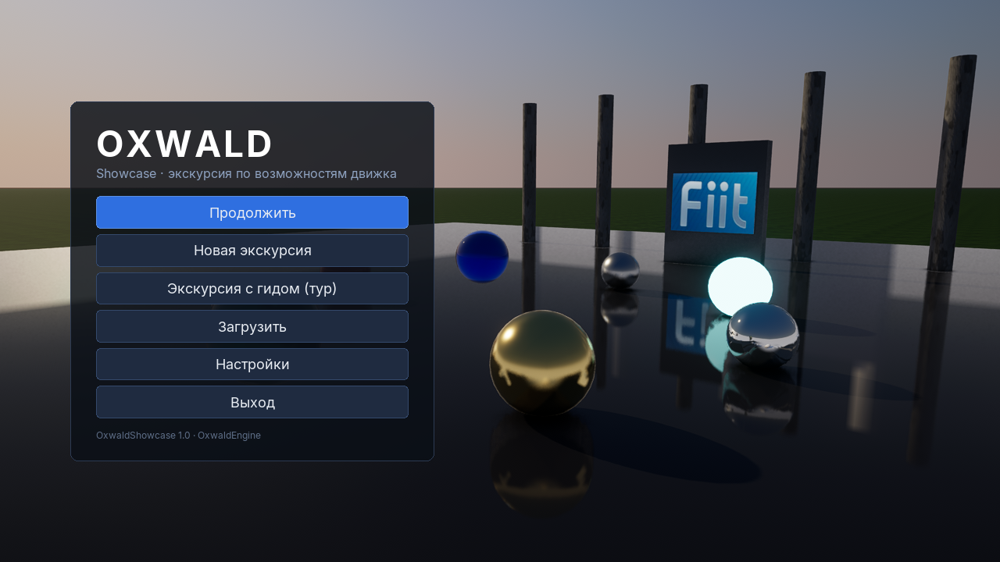

## Запуск

```sh
cmake --preset dev -B build/showcase -DVCPKG_MANIFEST_INSTALL=OFF
cmake --build build/showcase --target OxwaldPlayer OxwaldEditor oxshowcase_generate

# игра (окно, главное меню)
build/showcase/bin/OxwaldPlayer --project samples/OxwaldShowcase
# сразу на станцию
build/showcase/bin/OxwaldPlayer --project samples/OxwaldShowcase --scene project://Assets/Scenes/Stations/05_Water.oxscene
# экскурсия с гидом: камера облетает все станции с подписями (корутины C++)
build/showcase/bin/OxwaldPlayer --project samples/OxwaldShowcase -- --tour
# скриншоты всех станций (как в docs/guide/images/showcase)
build/showcase/bin/OxwaldPlayer --project samples/OxwaldShowcase --headless --frames 60000 -- --tour --quit --shots docs/guide/images/showcase
# один кадр одной сцены
build/showcase/bin/OxwaldPlayer --project samples/OxwaldShowcase --headless --scene project://Assets/Scenes/Hub.oxscene \
    --frames 150 --screenshot hub.png -- --photo
# редактор открывает хаб (editor.maps.editorStartupMap в .oxproj)
open build/showcase/bin/OxwaldEditor.app --args --project samples/OxwaldShowcase
```

Аргументы игры идут после `--`: `--tour` (экскурсия), `--photo` (камера ставится в точку `TourCam.A` сцены),
`--shots <папка>` (PNG каждой станции в туре), `--station <id>` (тур только по одной станции), `--quit` / `--stay`.
Экскурсию можно запустить и из главного меню («Экскурсия с гидом»).

## Управление

| Действие | Клавиатура / мышь | Геймпад |
| --- | --- | --- |
| Ходьба, бег, прыжок | WASD, Shift, Space | левый стик, нажатие стика, A |
| Камера, приближение | мышь, колесо | правый стик |
| Действие | E | X |
| Выстрел (станция «Физика») | ЛКМ | RT |
| Меню / пауза | Esc | Start |
| Быстрое сохранение / загрузка | F5 / F9 | — |
| Инфо-панель станции | I | Back |
| Отладочный оверлей ImGui | F1 или ~ | — |

Клавиши переназначаются в «Настройки → Управление» (сохраняются в `user://settings.json`).
В настройках также: общий уровень качества Low/Medium/High/Ultra и **Auto** (GPU-бенчмарк), уровни по группам,
трассировка лучей (серый переключатель с причиной на GPU без RT), апскейлер Off/FSR1/TAAU/DLSS с качеством и
масштабом рендера, окно/разрешение/VSync, громкость.

## Станции

| # | Станция | Что показывает | Где в проекте |
| --- | --- | --- | --- |
| — | Хаб | порталы, персонаж, сохранения | `Scenes/Hub.oxscene`, `Scripts/game.lua`, `player.lua`, `camera.lua`, `portal.lua`, `lib/flow.lua` |
| 1 | Свет и тени | CSM, прожектор и точечный свет с тенями, PCSS, 256 кластерных огней, время суток | `Stations/01_Lighting.oxscene`, `light_garden.lua`, `time_of_day.lua` |
| 2 | Материалы | сетка PBR, кожа и солдат из legacy-ассетов, эмиссия, alpha-test листва, стекло, матовое стекло | `02_Materials.oxscene`, `Materials/*.oxmat`, `Textures/Sky/park.oxcube` |
| 3 | Отражения и GI | SSR на зеркальном полу, пробы с box projection, плоское зеркало, GTAO, объём освещённости | `03_Reflections.oxscene`, `render_toggles.lua` |
| 4 | Волюметрика | froxel-туман, лучи сквозь окна, локальные объёмы тумана, облака, день/ночь | `04_Volumetrics.oxscene`, `time_of_day.lua` |
| 5 | Вода и частицы | волны Герстнера, плавучие ящики, каустика, под водой, огонь/дым/искры | `05_Water.oxscene`, `crate_spawner.lua`, `flicker.lua`, `Prefabs/FloatingCrate.oxprefab` |
| 6 | Открытый мир | процедурный ландшафт с эрозией и сплатами, растительность с ветром и импосторами, стриминг чанков | `06_World.oxscene`, `Chunks/*.oxprefab`, `world_station.lua` |
| 7 | Физика | башни, цепи на шарнирах, ворота с мотором, качели, триггер-катапульта, лучевое ружьё | `07_Physics.oxscene`, `raygun.lua`, `launch_pad.lua`, `physics_station.lua` |
| 8 | Анимация | скиннинговый манекен (glTF из генератора), blend space по скорости, two-bone IK на ступенях, aim IK | `08_Animation.oxscene`, `Models/Mannequin.gltf`, `locomotion.lua` |
| 9 | ИИ | навмеш, охранники с деревом поведения (патруль → погоня → поиск), восприятие | `09_AI.oxscene`, `AI/guard.oxbt`, `guard.lua`, `ai_station.lua` |
| 10 | Сплайны и корутины | поезд по сплайну, дверь хранилища, лифт и диалог на корутинах с `await` | `10_Splines.oxscene`, `train.lua`, `door_sequence.lua`, `elevator.lua`, `dialogue.lua` |
| 11 | Звук | 3D-источники, доплер, окклюзия за стеной, шина с реверберацией, ducking | `11_Audio.oxscene`, `audio_station.lua`, `reverb_zone.lua`, `Audio/*.wav` |
| 12 | Сеть | listen-сервер и бот-клиент через in-memory транспорт, интерполированные «призраки», статистика | `12_Network.oxscene`, `net_panel.lua`, `bot.lua`, `Source/net_demo.cpp` |
| 13 | RTX и апскейлеры | RT-переключатели с причиной недоступности, апскейлеры, масштаб рендера, GPU-тайминги | `13_RTX.oxscene`, `rtx_panel.lua` |
| 14 | Сохранения | точки сохранения, F5/F9, индикатор автосохранения, браузер слотов | `14_SaveGames.oxscene`, `save_point.lua`, `switch.lua`, `terminal.lua` |

Все сцены лежат в `Assets/Scenes/` (станции — в `Assets/Scenes/Stations/`), скрипты — в `Assets/Scripts/`,
интерфейс RmlUi — в `Assets/UI/` (`hud.rml`, `main_menu.rml`, `pause.rml`, `settings.rml`, `saves.rml`,
`dialogue.rml`, `side_panel.rml`, `theme.rcss`).

| | | |
| --- | --- | --- |
|  Хаб | 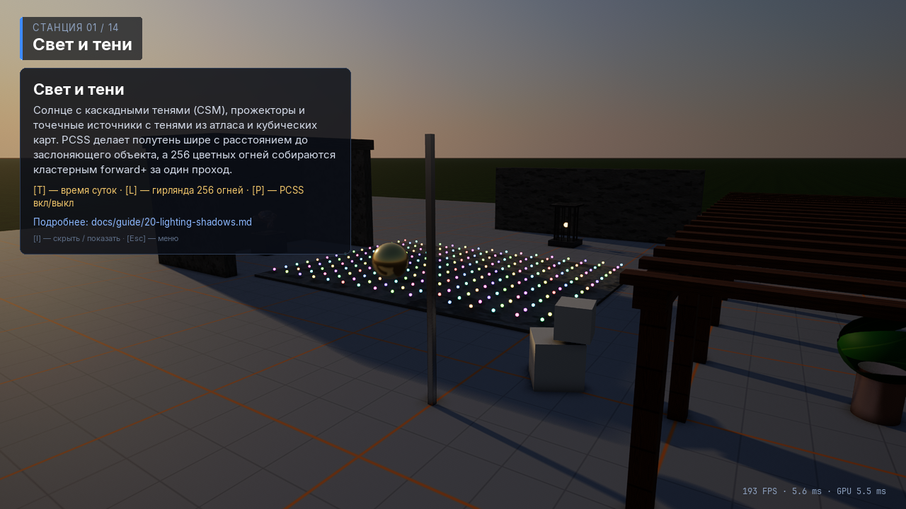 1. Свет и тени | 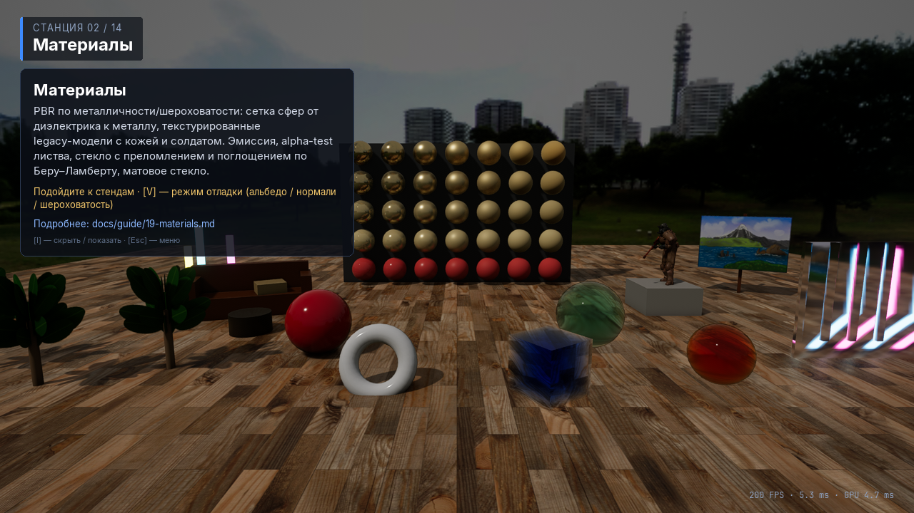 2. Материалы |
|  3. Отражения и GI |  4. Волюметрика |  5. Вода и частицы |
|  6. Открытый мир | 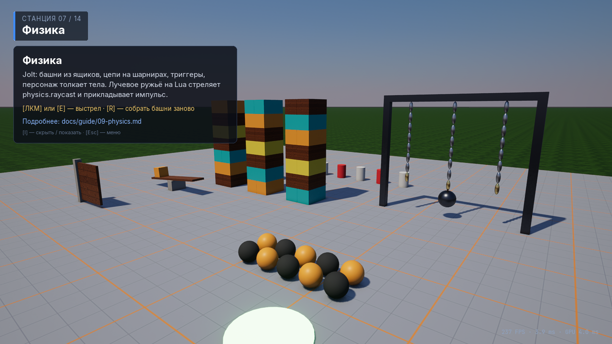 7. Физика | 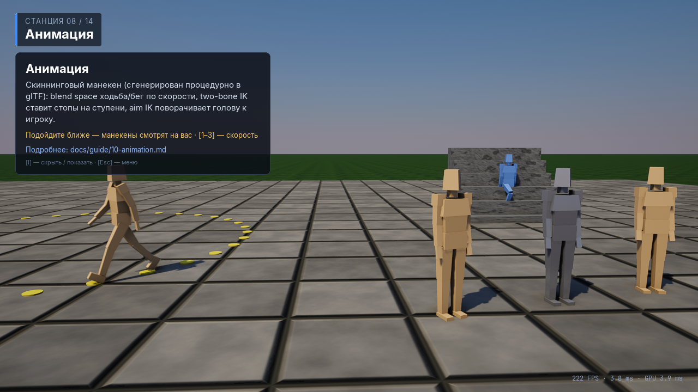 8. Анимация |
| 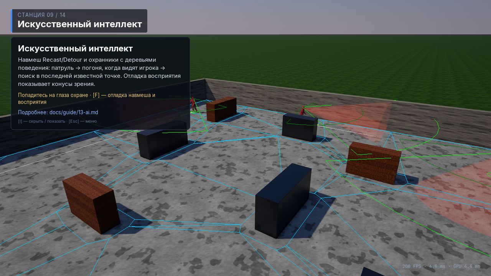 9. ИИ | 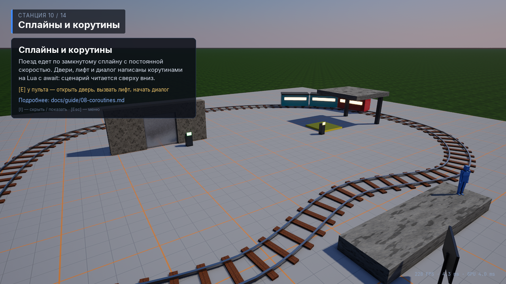 10. Сплайны и корутины | 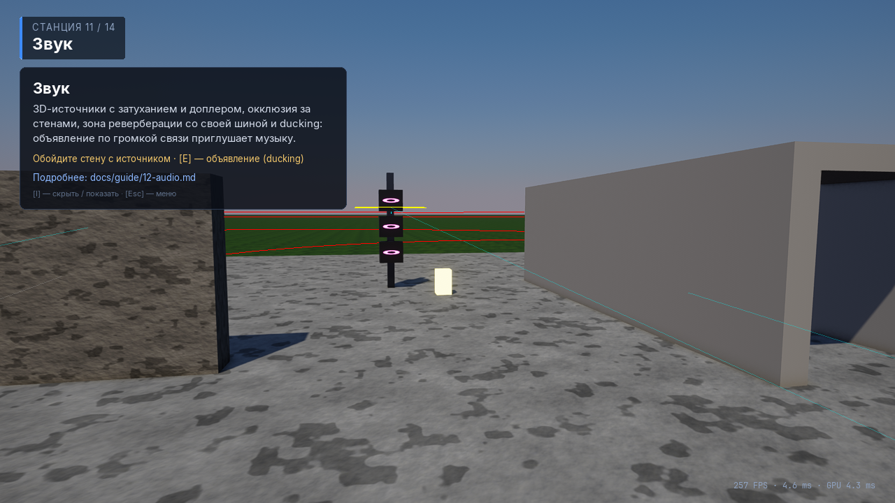 11. Звук |
| 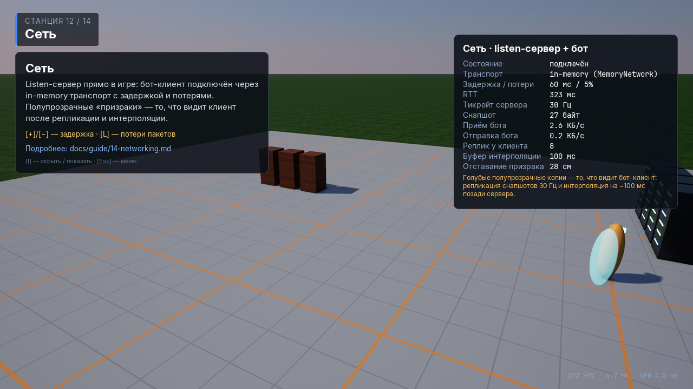 12. Сеть |  13. RTX и апскейлеры | 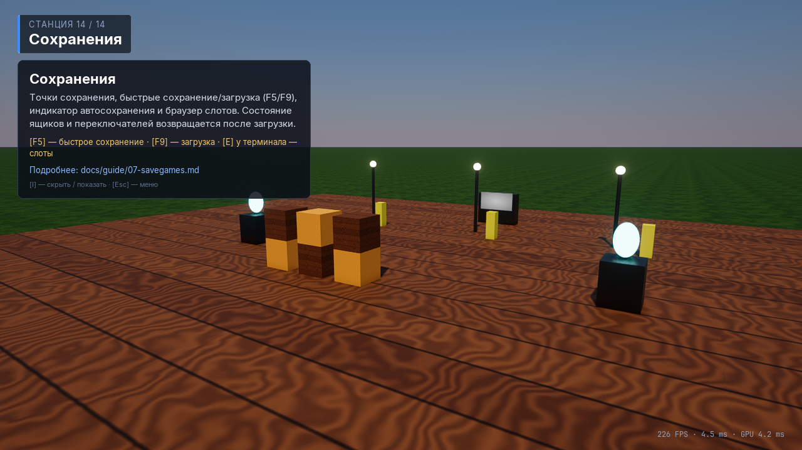 14. Сохранения |

Хаб в редакторе:

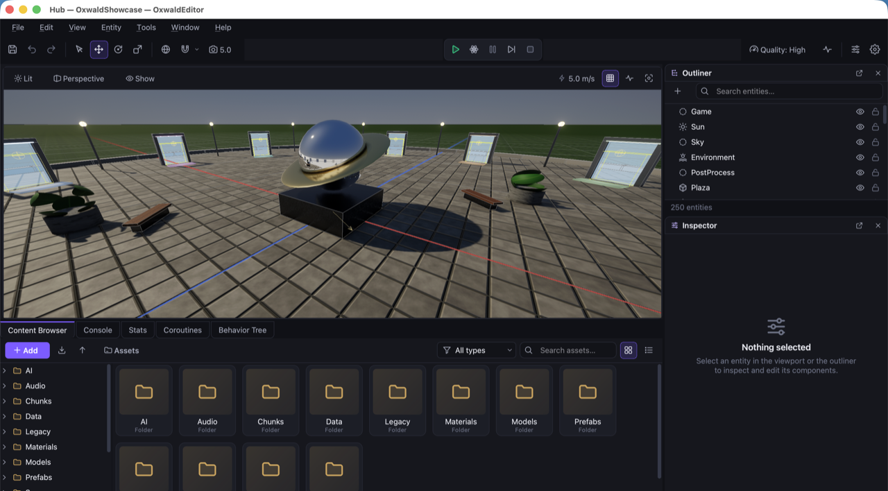

## Как устроен проект

```
OxwaldShowcase.oxproj   настройки проекта, ввод (действия Move/Look/Jump/Sprint/...), "modules": {"Showcase": true}
Assets/                 контент (всё, кроме Legacy/ и Scripts/UI, создаёт генератор)
Source/                 нативный игровой модуль «Showcase» (C++)
Tools/                  генератор oxshowcase_generate
Tests/                  тесты (ctest -L showcase)
```

**Генератор.** `Tools/generate_showcase.cpp` строит все сцены через `World`/`Entity`/компоненты и пишет
`.oxscene`, `.oxmat`, `.oxprefab`, процедурные текстуры, звуки (синтезированные WAV), скиннинговый манекен в glTF,
файл проекта и `.meta` с детерминированными UUID. Повторный запуск ничего не меняет:

```sh
cmake --build build/showcase --target oxshowcase_regenerate        # или build/showcase/bin/oxshowcase_generate
build/showcase/bin/oxshowcase_generate --check                     # 0 differences = файлы в репозитории актуальны
build/showcase/bin/oxshowcase_generate --only water                # одна сцена (menu, hub, <id станции>)
```

**Игровой модуль** (`Source/`, библиотека `ox_showcase_game`, регистрируется `OX_GAME_MODULE("Showcase", ...)`,
включается проектом). Даёт Lua-таблицу `showcase`: режим запуска, cvar'ы и консоль, смена уровней, сохранения
(выполняются в начале следующего кадра), сведения о GPU/RT/апскейлерах и GPU-тайминги, шины звука (реверберация,
ducking), управление сетевым демо, скриншоты, переназначение клавиш. Там же экскурсия (`tour.cpp`: по корутине
на уровень — смена уровня отменяет корутины) и сетевое демо (`net_demo.cpp`: мир станции — сервер, бот-клиент со
своим `World` получает его через `MemoryNetwork`, его интерполированный вид показан «призраками»).

**Lua.** `Scripts/game.lua` стоит на сущности `Game` каждой сцены (тексты инфо-стенда приходят из свойств
скрипта), общая логика меню/настроек/сохранений — модуль `Scripts/lib/flow.lua` (переживает смену уровней).

## Тесты

```sh
cmake --build build/showcase --target oxshowcase_generate OxwaldPlayer ox_showcase_tests
ctest --test-dir build/showcase -L showcase
```

`Showcase.GeneratorCheck` (содержимое совпадает с генератором), `Showcase.Scene.*` (каждая сцена 120 кадров в
headless-плеере без ошибок, Lua-ошибок и сообщений валидации), `Showcase.Tour` (экскурсия доходит до конца),
`ShowcaseScripts.AllCompile`, `ShowcaseSaves.RoundTripInSaveStation` (сохранение и загрузка ящиков и ламп).

## Ограничения

* На macOS (MoltenVK) трассировка лучей и DLSS недоступны — станция 13 показывает их серыми с причиной; на RTX
  переключатели работают без перезапуска.
* Скриншот (`--screenshot`, `--shots`) поддерживается только для headless-рендера.
* Ассеты в `Assets/Legacy/` — исходные модели и текстуры прошлых версий проекта (солдат, Suzanne, кожа, панорамы).
